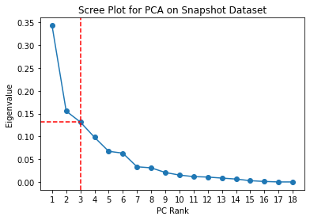
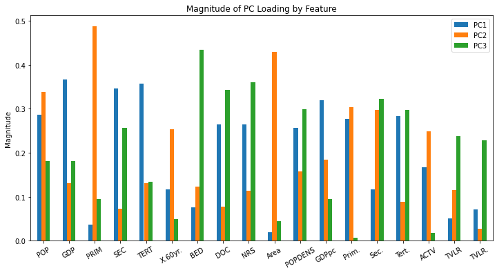
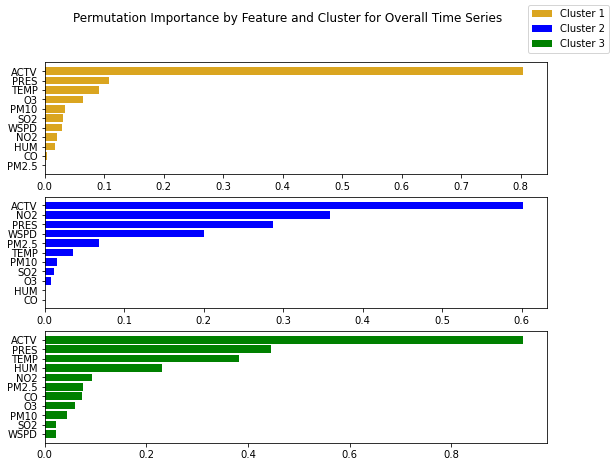
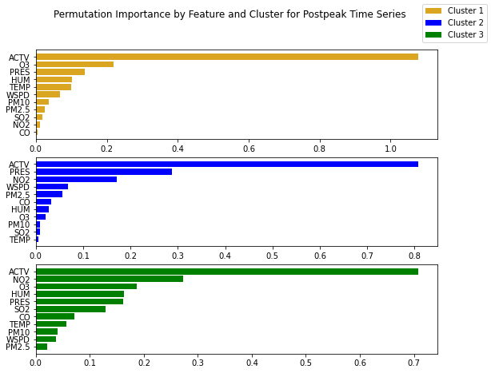
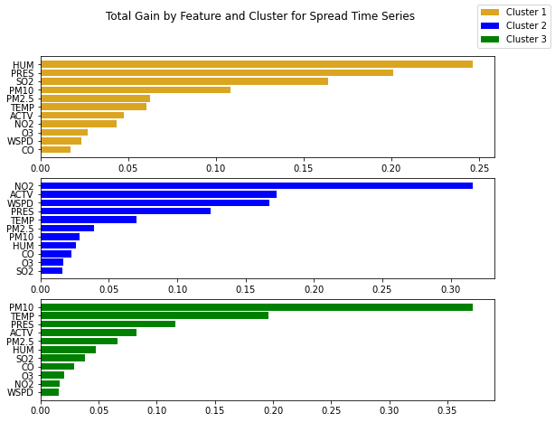

```{r setup, include=FALSE}
knitr::opts_chunk$set(echo = TRUE)
```

# I. Introduction and Summary 

In the paper \textit{Machine Learning-Aided Causal Inference Framework for Environmental Data Analysis: A COVID-19 Case Study} \cite{3}, Kang et. al explore the causal effect of environmental factors on COVID-19 severity. Using a combination of “snapshot” socio-economic indicators alongside time-series observations for 166 Chinese cities over a 76-day period from January to April 2020, the authors construct structural causal models (SCMs) to estimate causal relationships. After performing a series of robustness checks, the authors find that the vast majority (89 out of 90) of factor-effect relationships have no causal effect on COVID-19 severity. This paper provides two main conclusions: First, the specified environmental factors were unlikely to worsen the COVID-19 pandemic of 2020 and second, a combination of machine learning methods for dimensionality reduction and feature selection alongside structural causal models provide more robust conclusions than previous methods when investigating causation in the context of observational data. 

# II. Datasets and Summary Statistics 

For data cleaning, we obtained the datasets from the authors, compared them with the real data, and corrected mistakes. As the data were collected from hundreds of different sources, we decided that determining the accuracy of the features created by the authors was more important (and feasible) than re-constructing the data set from every source. As a result, we spent a larger amount of time on data quality checks. For instance, while calculating GDP, the total GDP should equal the combination of the primary, secondary and tertiary sectors. Tests were performed to examine if the above identity holds and mistakes were corrected to generate the proper numbers. We found a total of 4 typos that were significant enough to need correction. The numbers were compared with the official government statistics to correct the typos. In addition, certain columns of the summary statistics were expressed in different units and discrepancies were corrected. For example, the GDP data collected was quoted in RMB, while the summary statistics from the author used USD. Using an exchange rate from 2019 of 6.91 RMB to 1 USD, GDP figures were converted to the USD equivalency and summary statistics were reported using converted figures. Other data corrections involved proportion to percent conversions and per capita statistics being scaled correctly. Lastly, the data were parsed into three clusters to represent the relative sizes of the cities. The first cluster is “Megacities” which includes some of the largest cities in China, while the second and third clusters are “Major Cities” and “Common Cities”, respectively. 

Cleaning the COVID data set has proven to be the most challenging, since the process to clean the data will continue even after this project deadline. The case numbers were crosschecked with a dataset from Harvard Dataverse, and discrepancies were noticed on the 3 day moving sums. For example, the data on the city Fuzhou utilized 3 day moving sums at certain spots, while it used 2 day moving sums at other spots. The data would need to be cleaned and made sure that it is consistent in order for the future analyses to be more accurate. Moving forward, we will clean the data from Harvard Dataverse and apply a consistent 3 day moving average. 

We have placed the reproduced summary statistics figures in the Appendix. The summary statistics tables we have reproduced are originally from Table S1 and S3 in the supplemental information paper \cite{2}. From Table 1, we observe a large spread (e.g. SD, IQR) in many variables, including Population, City Area, and GDP. Looking closer at the quartiles and extreme values of these variables, we can infer that this population of cities is not homogeneous. For instance, the difference between 75th percentile GDP and the min GDP is far smaller than the difference between the max GDP and the 75th percentile. This suggests that there are clusters of cities which possess common characteristics, which we need to account for when performing causal inference. These differences by city type are summarized in Table 3, where the authors group mega-cities together into Cluster 1, large cities into Cluster 2, and smaller cities into Cluster 3. In this table, we can see that larger versus smaller cities have interesting differences in socio-economic indicators, such as elderly as a percentage of population, population density, and Wuhan (known to be the city of first major outbreak of COVID-19) travelers per thousand population. In contrast to the socio-economic indicators, there is considerably less spread for each environmental factor in the time-series data in Figure 2. This may be because the data is from a 3-day moving average over each variable, which reduces variability by smoothing sudden spikes. Another important point to note is that the statistics in Table 2 are computed over every city and date. Therefore, if we were to segment this data by date or city, it could potentially tell a different story.

# III. Causal Analysis Methodology

In particular, the authors take the following five-step methodology to estimate the causal effects of environmental factors on COVID-19 cases for 166 Chinese cities using observational data:
\begin{enumerate}
  \item Apply a dimensionality reduction and clustering algorithm on socioeconomic snapshot data to cluster together similar cities for stratified analysis
  \item Partition time-series data on environmental factors by cluster membership and phase (spreading phase vs. postpeak phase)
  \item Fit interpretable machine learning models on each partitioned time-series to predict COVID cases using environmental factors as predictors
  \item Find feature importance scores for each fitted machine learning model to determine the environmental factors which are most predictive of COVID cases 
  \item Formulate and perform inference on a Structural Causal Model to capture causal relationships between all environmental factors (treatments), unobserved confounders, and COVID cases (outcome)
\end{enumerate}

Using this methodology, the authors find that most of the causal effects are close to 0, implying that environmental factors were not direct drivers of COVID transmission during the COVID-19 pandemic of 2020.

## Replication Part 1: Stratifying by City Characteristics

The original snapshot data had around 18 dimensions, making stratification by city demographics extremely challenging. In particular, creating too many strata would reduce the number of data points per strata, and thereby make causal estimates have high variance. On the other hand, controlling using too few strata would ignore certain (potentially) confounding variables which could bias treatment effect estimates. As a result, the authors chose to use dimensionality reduction paired with clustering to find the strata which best capture the information the socioeconomic snapshot covariates provided. 

The specific algorithm the authors chose was Principal Components Analysis (PCA). The technique of PCA is, in essence, “creating new uncorrelated variables that successively maximize variance. Finding such new variables, the principal components, reduces to solving an eigenvalue/eigenvector problem, and the new variables are defined by the dataset at hand, not a priori, hence making PCA an adaptive data analysis technique." \cite{4} As observed in Figure 2, the authors found that around 62\% of the variance in the snapshot data could be explained by 3 principal components, leading them to choose that as the number of dimensions to reduce the data to. This was further justified by looking at the plot in Figure 1, where the authors argued that the elbow in the curve principal components was indicative that 3 principal components could adequately express the complexity of the snapshot data. However, since a the culprit of observational studies is selection bias, it is critical to control for as many confounding covariates as possible. As such, we would recommend using a larger number of principal components to explain more variance in the snapshot data (perhaps around 90\%). 

After the dimensionality reduction via PCA was completed, the k-means algorithm was applied to the reduced components to algorithmically find clusters in the data. In the paper, the author tested $k$’s from $1-9$, and ultimately selected $k=3$ as the final number of clusters used. The key idea in k-means clustering is finding centroids that minimize the "inertia", or the within-cluster sum of squares. Mathematically, it can be expressed as the process to solve for:$$\sum_{i=0}^{n} \text{min}_{\mu_j\in C}(||x_i-\mu_j||^2)$$

The algorithm is essentially as follows: When a value for $k$ is selected, random $k$ centroids are placed, and the distance between each point to the $k$ centroids is calculated. After the distance is calculated, the differences are compared, and a point is considered to be in the cluster for which the distance it is the closest to. By this algorithm, $k$ clusters with their centroids are formed, with each point in the cluster being closer to the cluster's centroid than any other centroids available. After the clustering is done, the center of the cluster is calculated, and is treated as the new centroid. The process is repeated again and clusters are reformed. The algorithm stops when all of the centroids stop moving, which happens when the sum of squares is minimized. 

The inertia for the different $k$ values is reported in Figure 4. Having $9$ different $k$ values to choose from, the authors utilized the "elbow" method to select the most optimal $k$. The elbow method finds the point where the plot begins to descend linearly, for which the authors determined to be $3$. Hence the authors divided the 166 cities into three clusters- Megacities, which included 7 cities; Major cities, which included 40 cities, and Common cities, which included 119 cities. The three different clusters and their three-dimensional locations on the three PCA's is reported in the Appendix as Figure 5. 

Though the cities were divided out through machine learning algorithms, the validity and applicability of the algorithm in this case needs to be thoroughly questioned and considered. Our best understanding of what the principal components mean stems from Figure 3, where the PC loading magnitudes are plotted by covariate. Looking at the figure, it immediately sticks out that many features are highly prevalent in each PC, making any connection between PCs and the true covariates hard to decipher. In addition, no heuristic pattern can be easily be observed within the different clusters of cities, despite the authors' claim. For example, if talking about population size, multiple cities classified as "Major" do not nearly have enough population as some clustered in "Common." For example, Lhasa, the capital of Tibet has a population of approximately 300,000 people, while the population of Tangshan is around 7 million, but Lhasa is included as a "Major" city while Tangshan is only classified as "Common". Observing GDP per capita and total GDP figures also show Tangshan higher in the rankings compared to Lhasa. Politically, one may argue that Lhasa has more political importance due to its importance in maintaining the peace and stability of the Tibetian region, but this paper is not a political science journal and does not analyze the cities from any political perspectives but more on economic factors. 

## Replication Part 2: Time Series Analysis of Environmental Factors 

In addition to separating out the cities by clusters, the authors further parsed the time series data into two segments, one for which they deemed to be a "pandemic spreading" phase, and the second for which they deemed to be a "post-peak" phase. For the cities in the Megacities category, the cutoff date was February 3, 2020 while for the other two categories, the cutoff was set at February 6, 2020. This division made sense as it seeks to control for some covariates that may have influenced the pandemic's spread in the particular city. For example, if a city is not widely travelled to and is loosely populated, it may very well not have been in contact with COVID until later in 2020, while major cities and large population centers may have been in contact with COVID since the beginning of the pandemic as they are travel hotspots and there is great population flow through them.

After each subdatasets have been setup, the authors utilized both interpretable machine learning algorithms to determine the predictive ability of environmental factors on COVID case numbers. In particular, the XGBoost was used as the machine learning algorithm of choice, due to its flexibility and inbuilt interpretability scores. The XGBoost works first by traversing all the features of the dataset and sorting the instances by eigenvalues separately. It then determines the split points for each feature by finding the point where the information gain is the highest. The information gain is defined as: $$Gain = \frac{1}{2}\Bigg[\frac{G_L^2}{H_L+\lambda} + \frac{G_R^2}{H_R+\lambda} - \frac{(G_L+G_R)^2}{H_L+H_R+\lambda}\Bigg] - \gamma$$ where G and H are the sum of the first and second derivatives of, respectively, all the samples in a node L or node R, while $\lambda$ and $\gamma$ are constants.   With the information gain, the algorithm then constructs the optimal tree structure by choosing the best split strategy for all the features.

In the usage of XGBoost algorithm, the models were trained with the aid of k-fold cross-validation. This method splits an existing dataset into k different folds, and uses each fold as a testing set against the remainder of the data. The authors selected $k = 5$ as the most optimal point to minimize the impact of overfilling or sampling bias. Moreover, the authors combined the cross-validation with a grid search strategy to find optimal hyperparameter values. We report the results of the model training process in the Appendix as Table 4. One point of note is that due to limited computational resources, we were not able to cover the full hyper-parameter sweep that the author's used, and therefore had slightly weaker models due to suboptimal hyperparameters. 

After the training is complete, the authors used the total gain and permutation score to interpret the trained models. The total gain score is calculated as the product between a feature's gain score and the frequency of the feature in being used for node splitting when constructing the model, while the permutation score is defined as the decrease of the model performance when a single feature is randomly shuffled. However, the author notes in their paper that a common shortfall of the two metrics is their relative inability to determine whether a feature's contribution is positive or negative, thus the authors further utilized SHAP interaction values to analyze the direction of the feature contribution. 

In our replication, we studied extracted both the total gain and the permutation score for all the sub datasets that we have. The total gain score for all the data (without dividing the data into post peak and spreading phases) is reported in the Appendix as Figure 6, while the permutation importance is reported as Figure 7. For the data that is postpeak, the total gain score and permutation scores are reported are reported as Figure 8 and Figure 9 respectively, while the data that is during the spreading phase is reported in Figure 10 and Figure 11 for the total gain scores and the permutation scores, respectively. Though we cannot definitely say which factors are the "most important", several highlights needs to be made. First, the ACTV effect can be seen as quite important across the board. Particularly, in Figure 7, the permutation importance of the ACTV feature seemingly dominates all the other features for all three clusters. Second, from our results, PRES also seems to be quite an important contributing factor, as its ranking is generally quite high across all the clusters and time periods. With regards to other variables, the feature importance is much more difficult to interpret as their ranking and values shift dramatically across permutation importance vs gain score and across the different clusters/time periods. However, the reader should also note that our results are currently as we were constrained by our limited computational resources, and we were not able to reproduce the results for the SHAP interaction values. 

## Part 3: Structural Causal Model and Treatment Effect Estimation 

To compute the treatment effect estimation, the authors use the Structural Causal Model (SCM), as specified in Figure 12. The authors began with a directed acrylic graph (DAG), where each of the nodes are variables, each arrow represents a causal link, with blue ones indicating relationships that have been proven prior and the red arrows are unproven causal links. From the original paper, it was unclear how exactly the results from the feature importances derived from the trained XGBoost models were used to specify this SCM. The authors attempted to distinguish between already proven causal effects and those who have not been proven. However, the author did not offer any explanation with regards to how the "proven causal effects" were established or any calculations that were involved in reaching the causal effects. Though some of the relationships may seem intuitive to readers, this way of formatting causal inferences is very casual in our sense and their assumptions of their causal relationships need to be thought of very carefully.

To perform inference on the specified SCM, the authors used both linear and non-linear techniques to estimate the conditional average treatment effect: Ordinary Least Squares and Orthogonal Random Forests. The results are summarized in Tables 5-6. Due to insufficient computational resources, we weren't able to finish running the results for Cluster 3 (common cities) due to the large number of data points falling within the category. 

In Tables 2-3, we show the estimated treatment effects for clusters 1 and 2 (which are the Megacities and Major cities, respectively) for four different treatments- pressure, temperature, humidity, and windspeed. The results is the estimation of the various treatments on the spread of COVID spread in the particular city. As the reader can easily note, though sometimes the results of the linear OLS and the nonliner ORF results are quite similar, other times they are dramatically different. In the results that we have computed, the temperature estimate for cluster 2 under OLS is 0.011, while the result under ORF is 0.0002, which is different by a factor of over 50 times, so selecting which model is accurate in estimating the relationships may be very critical. 

We note that in running ordinary least squares regression, a linear relationship is assumed. In orthogonal random forest, estimation, non-parametric estimation of the target parameters is performed. However, the authors did not mention at all how the results were reached and just reported whether they used the linear or nonlinear models, which is a significance weakness in their report and should be treated critically. 

This paper utilized numerous machine learning algorithms to reach their conclusions, and the procedure can be said as quite robust. After the average treatment effects were calculated, the authors further utilized multiple refutation tests to test the robustness of their results. We will replicate this part of the paper and disucss more of their robustness checks in the robustness analysis section. In the author's conclusions, only one relationship, the effects between temperature and COVID cases in cluster 2 was deemed to be robust enough for the authors. 

Looking at the paper overall, we critique the author over their lack of transparency over key points in the paper. For example, when the authors were separating the cities into the clustering, we believe that additional heuristic and sanity checks should have been performed to analyze the reasoning for the clusterings, as the PCAs the authors have selected have relatively low variance explanation and does not make heuristic sense in some cases. In addition, when the authors decided to establish "known causal relationship", the authors did not seem to explain what the underlying assumptions were and just proceeded with their analysis. On top of this, the author also did not explain their method for establishing the ATEs on whether the relationships are linear or nonlinear. The authors were generally unclear with regards to their mathematical methods and the computational tools and processes that they utilized, which made interpreting their results and replicating their results an extremely taxing task. In conclusion, we cannot be certain that the relationships the authors have established can be deemed to be acceptable given the above mentioned concerns. In the later sections of this report, we apply additional causal methods in our re-analysis to see what causal relationships can we try to establish. 

## Causal Refutation Methodology and Results

In the paper, the author used two refutation methods to check for the robustness of the results- random common cause (RCC) and placebo treatment (PT). The random common cause treatment adds an independent noise variable as a covariate to the data set and tests the causal effects of the data set. If the relationship is indeed causal, the results stemmed from the treatment should still be relatively stable. Under the placebo treatment test, the tested treatment variable is replaced by noise values instead of the original value, and a causal relationship is estimated again. The effects estimated under the placebo treatment should be 0 instead of the original values.

With the above testing methods, the author utilized four refutation criteria. The first criterion is for the treatment variable to pass both the placebo treatment test and the RCC test. More specifically, in order for a treatment variable to be considered "passed", its deviation from the original estimated value under the RCC test must be under 10% and results under the placebo treatment test must not be significantly different from 0. If both of these tests are passed, then additional three criterions were established by the authors to further enhance the robustness checks. The other three criterions are thresholds under the RCC test, where the deviations are set at 5%, 1% and 0.5% of the original value, indicating increasing strictness of the test. The authors mandate that a treatment variable pass all four levels of robustness checks in order for a treatment varaible to be considered robust enough.

Under the above-mentioned refutation methods, the wide majority of the estimated treatment variables were refuted by the authors. Looking at the different air pollution factors, PM10 in the cluster 3 spreading phase passed the 1% threshold refutation with a positive ATE value but did not pass the final refutation. For PM2.5, two potential causal effects- one for cluster 2 overall and a second one for cluster 2 during the postpeak phase both did not pass the 1% refutation test. In terms of CO, the cluster 3 postpeak phase passed the initial refutation test but failed at the 5% threshold test, while the SO2 treatment for cluster 3 spreading phase passed the initial and 5% refutation tests but failed at the 1% threshold level. Analyzing meteorological relationship, most of the relationships failed at the 5% level of refutation which indicated that they are most likely insignificant from the authors' perspective. However, one result did pass all of the refutation level tests- air temperature in the cluster 2 spreading phase. This causal effect passed the final refutation test with a causal effect of 0.041, which approximately indicates that given a 1 degree Celsius increase in temperature, this effect increases the newly confirmed cases for cluster 2 during the spreading phase by 0.183 after adjusting for the normalizations. However the authors do note that the final RCC refutation test was passed by 0.00498, which is very close to the threshold of 0.005. The authors finally comments that though this causal relationship cannot be ruled out, it can be generally said that from their analysis, environmental factors did not generally have an exacerbation impact on the COVID-19  pandemic in the selected Chinese cities during the period selected. 

However, the authors were not very clear in exactly how they selected the treatment effect estimations. They did not state in their paper how they determined whether a relationship was linear or nonlinear, but rather simply reported the results as one or the other. In addition, the authors failed to report any methods they used to see if the results are statistically significant or not. The authors also seemed to only use positive results, in the ATE, for which they did not explicitly explain why.

# V. Data Re-Analysis 

In the previous portions of our paper, we have attempted to replicate a paper that is analyzing the causal effects of environmental factors on the number of confirmed COVID cases in China. The authors utilized machine learning methods, or more specifically, XGBoost to make causal inferences. In this section, we will attempt to re-analyze the data using different models in attempt to address the same questions as well.

However, there are numerous challenges that exist to analyze the data. The biggest challenge to analyzing the causal effects of the data is that the treatment variable is not well defined for our data set which makes the causal question difficult to formulate. Our "treatment" variables consists of different levels of different environmental factors which cannot be binarized into a 0 and 1 function easily. Fundamentally, the challenge for the question we are addressing is that it is almost impossible to consider an experimental setting where we can change one of the variables while keeping the other covariates constant. Further, given the different levels of environmental factor that we are observing, it is also difficult to state which level should be considered the "treatment" and which level is the "control". Thus the causal question at hand is extremely difficult to formulate under the context of Causal Inference.

[TODO] Add note that in these models, we used the entire data set will all variables (snapshot + time series environmental factors)

## Method 1: Mutliple Regression Model

In re-analyzing the data we have, we first propose the multiple regression model. In this model, we are attempting to measure the direct effects of the different environmental factors on the spread of COVID 19 in China. The model that we are using can be expressed as the following:

$$Y_i = \beta_0 + \beta_1 X_{1i} + \beta_2 X_{2i}......\beta_k X_{ki} + u_i, i = 1...n $$

where $Y_i$ is the outcome of the dependent variable, $X_1$ can be notated as the "treatment" variable that we are interested in, while the other $X$'s are the different covariates that we are controlling for, and $u_i$ is an error term for entry $i$. In our case, the different covariates are the economical and demographic data on this data set, such as GDP, population, hospital beds, etc. while the outcome is the number of newly confirmed COVID cases. 

Interpreting the results, the coefficient $\beta_1$ can be interpreted as the how the number of newly confirmed COVID cases change given changes in the "treatment" variable while controlling for the different covariates. The results of the regressions are shown in Table 8. 

However, in order to deepen our understanding of the results and critique the conclusions that we have made, we must consider the basic assumptions of the multiple regression model. The assumptions of the multiple regression models are:

* $u_i$ has conditional mean zero given $X_{1i}...X_{ki}$. Or expressed in mathematics:

$$E[u_i|X_{1i}...X_{ki}] = 0$$

* $(X_{1i}...X_{ki}, Y_i)$, i = 1....n are drawn i.i.d. from the joint distributions.

* Large outliers are unlikely: $X_{1i}...X_{ki}$ and $Y_i$ all have non-zero, finite fourth moments.

* There is no perfect multicollinearity, which means that none of the regressors are perfect linear functions of the other regressors.

The first assumption should hold relatively easily as there is an intercept term in the regression that we are performing. 

The second assumption is quite strong, but must be imposed in order for us to make any progress on the multiple regression. We  must assume that all of the draws are drawn independently from the joint distribution of the covariates and outcome, which is highly unlikely due to the fact that a lot of the covariates are dependent on each other in one way or another (for example, a larger population size tends to correlate with a higher level of GDP.)

The third assumption holds relatively easily as the entries are all finite.

The fourth assumption holds if we make some adjustments to our data. In our data, the only place where multicollinearity happens is related to the different sectors' GDP. The primary sector, secondary sector, and tertiary sectors should sum up to 100%, so in our analysis, we exclude one of the sectors (tertiary sector) in terms of the percentage it accounts for in a city's overall GDP as well as the absolute value of the GDP.  By excluding those two variables, we should not have any multicollinearity in our data. 

Further, if we assume that the covariates that are included in the data set are complete so that there is no omitted variables bias, and that controlling for all the covariates, unconfoundedness holds then the coefficients may be interpreted with causal framework in answering how does changing the specific environmental factor affect the number of confirmed COVID cases. 

However, this assumption, along with the assumption that the samples are drawn i.i.d. from the joint distribution is extremely strong and unlikely to hold. We do not know if there is an omitted variable that may impact the outcome in a significant way, nor can we verify that the samples are drawn independently, which are significant weaknesses of our model. In addition, we are not considering the environmental factors are covariates in this case, as they may very well be covariates for the other environmental factors as well. Controlling for environmental factors in the analysis may help improve the interpretability of our results (we omit this regression as there are 1024 possible regressions to run and the results would be impossible to report here.) We have further assumed that the linear model is true here, which we have not tested and examined in full detail, which may a further area this analysis can be improved upon in the future.

## Method 2: Multiple Regression Model with Interactions

We here propose an alternative method to analyze the data using multiple regression, by including an interaction term between the "treatment" variable and the covariates. The model can be described as the following:

$$Y_i = \beta_0 + \beta_1 X_{1i} + \beta_2 X_{2i}......\beta_k X_{ki} + \beta_{k+1} X_{1i}X_{2i}...+\beta_{2k-1}X_{1i}X_{ki} + u_i, i = 1...n $$
where $X_{1i}$ is the treatment variable and the other $X_{i}$ terms are the covariates, and $u_i$ is an error term.

Similar assumptions with relation to multiple regression holds here. We also exclude the percentage of GDP in the tertiary sector and the absolute value of GDP in the tertiary sector in the analysis to avoid multicollinearity. 

The difference in this approach compared to the simple multiple regression is that we are now considering the different effects the covariates may have on the treatments In the simple multiple regression, we assume that the effects of the treatment are constant given the covariates, where the $\beta_1$ term measuring the effect for the treatment $X_{1i}$. With interaction terms, we no longer assume that the effects of the covariates are constant, and we now also account for the different effects the covariate terms may have on the treatment variable. 

The results from this regression is shown in Table 9. We exclude the interaction terms in the table due to their volume. Only the results for the covariate terms and the treatment terms are reported.

## Method 3: Fixed Effect Regression 

What the multiple regression model presented earlier does not account for is the characteristics of the cities that are fixed over time. For example, in our data set, demographic and economic indicators are fixed over time. Even though factors such as population, GDP, hospital beds, etc. are fluid over time, government agencies tend to record these data for a given time period given their difficulty in data agglomeration and estimation. The data that this data set contains is from government reports and statistical yearbooks for 2019, and we will assume that the covariate data is constant across the time.

With the above mentioned assumptions, an analysis considering the effects of time may be more applicable than a multiple regression model. Hence we here conduct our analysis again but as panel data with fixed effects regression, and we consider the following model:

$$Y_{it} = \beta_1X_{1, it} + ... \beta_kX_{k, it} + \alpha_i + u_{it} $$
Where $Y_{it}$ is the outcome for entity $i$ and time $t$. For this data set, the increments of $t$ that we are observing is days, and the entity we are identifying are the various cities in China. $X_{k, it}$ describe the value of the regressors for entity $i$ at time period $t$. In the fixed effects regression that we run, we include a regressor for the specific pollutant level for city $i$ at time $t$, and also a variable for the activity level of the city, which is a covariate that is varying in time. The remainder of the covariates are assumed to be constant in time, and are notated as $\alpha_i$ in the above equation. The components of $\alpha_i$ includes the various economic and demographic factors that we have mentioned earlier that are assumed to be constant over time. Lastly, $u_{it}$ is the error for entity $i$ at time $t$.

How the programs run fixed effect regressions is done in two steps. In the first step, entity specific averages are subtracted out for each of the variables. In this manner, all of the fixed effects that are identified will be differenced out. More specifically, expressed in mathematics for two variables that vary across the time as we are analyzing for our current data set, the procedure is:

$$Y_{it} - \bar{Y} = \beta_1(X_{1, it} - \bar{X_{1,i}}) +  \beta_2(X_{2, it} - \bar{X_{2,i}})  + (u_{it} - \bar{u_i})$$

With the above values, OLS regression is ran and $\beta_1$ is estimated. The results of the fixed effects regression for our data set is displayed in the following page as Table 3.

To more fully interpret the results of the fixed effects regression model, we must again understand the assumptions the model is making. The assumptions are quite close to the assumptions made under the multiple regression model, and are stated below:

* $u_i$ has conditional mean zero given $X_{1, it}, X_{2, it}...X_{k, it}, \alpha_i$. Or expressed in mathematics:

$$E[u_{it}|X_{1, it}, X_{2, it}...X_{k, it}, \alpha_i] = 0$$

* $(X_{1, it}, X_{2, it}...X_{k, it}, u_{i1}, u_{i2}...u_{iT})$, i = 1....n are drawn i.i.d. from the joint distributions.

* Large outliers are unlikely: $X_{it}$ and $u_{it}$ all have non-zero, finite fourth moments.

* There is no perfect multicollinearity.

The first, third, and fourth assumptions hold more easily while the second reasoning is more challenging to hold for our data set for similar reasoning as explained in the section about multiple regression. However, advantages are present with the fixed effects regression model compared to the multiple regression models. Given that our data consists of data from different cities across China and across multiple time periods, this model of analysis is the most appropriate panel data analysis is meant specifically for this type of analysis.

With this model, there are also obvious disadvantages and the assumptions that must be considered also. In this model, we assume that the "fixed" covariates do not have an effect on the outcome, but this may contribute to ommitted variables bias if the covariates actually have an impact on the outcome. For example, if there were actually some effect of GDP on the newly confirmed cases in a city, this effect cannot be captured as the GDP values have all been differenced out and cannot be observed. In order for the fixed effects regrssion to be more causal in the interpretation, an additional assumption should be said that the fixed effects from the different entities have no effects on the outcomes, or else the estimates we received from the regression will be biased.

In addition, the assumption that all of the variables are fixed in time is also a very strong assumption, and may affect the interpretation of our results. For example, we have assumed in the original data set that the number of hospital beds, nurses, and doctors are constant in the city across this time period. However, due to the news of the COVID-19 pandemic, these numbers may fluctuate wildly from what were originally reported. If we assume that these factors do not impact the spread of COVID-19 in a particular city, then by differencing them out in the fixed regression the analysis will be sensible. However, if the truth is, for a heuristic example, that if a city that obtains more hospital beds to treat patients that are infected by the virus it may be more successful in containing the virus later on, then differencing out these factors and assuming that they are constant would bias the results that were obtained by the fixed effects regression. In order to interpret the data better, we must further assume that the fixed effects that we have identified are in fact, fixed, which is likely not true for our data set.

Further, even if the above two assumption holds perfectly, we must always consider the case where there may be other variables that vary in time that we have failed to consider, that also has an impact on the outcome. With the assumptions of the fixed effects regression model, variables that do not vary in time do not contribute to the outcome but variables that vary in time may still contribute to the outcome. In our data set, we identified the activity level of a city as a variable that is varying in time. However, other obvious variables have not been identified that may significantly contribute to the outcome. For example, the number of COVID tests that were given in a particular day may significantly influence the number of confirmed cases within a particular city. If no COVID tests were given, 0 cases will be identified, while if the testing capacities increased, more cases may become confirmed. 

If the four assumptions for the fixed effects regression model hold, plus the additional three assumptions that we present above also hold, then the results derived from the fixed regression model may be interpreted causally. However, as previously discussed, the assumptions are extremely unlikely to hold and more analysis and a more complete data may be needed in order to obtain a more robust result.

## Method 4: Matching 

In our this re-analysis approach, we attempted to transform the data into a more canonical causal inference problem— one where the treatment variable is binary. To achieve this, for each date and treatment variable, we binarized the continuous treatments per city into two categories: high (1) and low (0). For each city, if their treatment value was higher than the median treatment value of all cities on that particular day, they received a 1 and vice versa. Using this approach, we could consider applying several of the canonical causal effect estimators.

For the purposes of this problem, we believed that the matching estimator would be the most appropriate. This is because our causal assumption is that COVID cases in cities on a fixed date are interchangeable, given their covariate information (e.g. population size, GDP, etc.). As such, matching would allow us to generate good quality counterfactuals, rather than algorithmically grouping together cities in an uninterpretable fashion, like the original paper implements. Specifically, the matching process aims to find, for each individual $i$, $K$ counterfactual units to minimize $|| X_j - X_i ||$, where $|| \cdot ||$ is some distance metric (e.g. Mahalanobis distance). In our case, we used $k$-Nearest Neighbor matching with $K = 5$ and Mahalanobis distance as our distance metric to generate matches. Our choice for the number of counterfactual matches was driven by the idea that we wanted to balance between accounting for enough geographical city similarities (suggesting to decrease $K$) and introducing bias due to city-specific characteristics not present in our observed covariates (suggesting to increase $K$). 

The results of the matching estimation process are given in Table 11. In the estimation process, we corrected for matching bias, which is the bias introduced due to discrepancies in the covariate values of units and their matched counterfactuals. This bias is given by $\mathbb{E}[Y(1)|X = X_i] - \mathbb{E}[Y(0)| X = X_j]$ where $||X_i - X_j|| > 0$. As Wong explains \cite{4}, we can correct for this bias by assuming local linearity in the conditional expectation and directly approximate this bias term. This is a reasonable (i.e. much less strong) assumption than assuming linearity across the covariate space with OLS-based ATE estimators. From our results, we can observe that there is a significant time component involved. For example, the ATE estimates of treatments like Pressure, Temperature, and Humidity tend to rise and fall together in groups of 10 days. In addition, we can observe that most of the ATE estimates are close to $0$ and the standard errors are relatively large (relavive to the point estimates), leading to large uncertainty. To get causal effect estimates over the entire timespan, we average the ATE estimates and apply the conservative variance estimator, which adds the variances together. These aggregated results are presented in Table 12. When looking at the 95% Confidence Intervals, we can observe that not a single treatment factor is statisically significant, which agrees with the authors' conclusion on the causal effects of environmental factors. 

There are two important caveats with this approach. First, the matching estimator assumes unconfoundedness, $Z \indep \{Y(0), Y(1) \} | X$. We are fairly confident that unconfoundedness does not hold in this scenario, as we saw previously that there exists time-based variation, leading us to believe that this was a unaccounted-for variable. In addition, we believe that it would be hard for unconfoundedness to ever be plausible in this set up, since environmental factors cannot reasonably be considered as randomized due to autocorrelation, geographical similarities, and its fundamentally uncontrollable nature. Secondly, the fundamental assumption of causal inference (SUTVA) assumes no spillover effects which is likely violated in this observational setup. As a result, we must take these results with healthy skepticism. In future experiments, we suggest trying to remove the time-component of the data through time-series methods before identifying causal effects. Despite this approach's weaknesses, we still believe that it is reasonable to consider over the author's methodology, which neglects the fundamentals of the causal inference.  

# VI. Conclusion


\newpage 
# Figures 
\newgeometry{margin=0.1cm}
\centering 
## Table 1: Socio-economic "Snapshot" Summary Statistics
\begin{tabular}{lrrrrrrrr}
\toprule
{} &      Mean &       SD &      Min &  25th \%ile &    Median &  75th \%ile &       Max &      IQR \\
\midrule
\textbf{Population (in thousands)             } &   5624.67 &  4029.79 &   720.96 &    3176.92 &   4666.55 &    7181.67 &  31243.20 &  4004.75 \\
\textbf{GDP (Billions USD)                    } &     66.02 &    81.53 &     5.13 &      23.14 &     39.94 &      72.06 &    552.18 &    48.92 \\
\textbf{Primary sector (Billions USD)         } &      3.54 &     2.53 &     0.17 &       1.93 &      3.13 &       4.65 &     22.45 &     2.72 \\
\textbf{Secondary sector (Billions USD)       } &     25.80 &    26.94 &     1.89 &      10.20 &     16.21 &      29.99 &    151.89 &    19.79 \\
\textbf{Tertiary sector (Billions USD)        } &     36.68 &    57.06 &     2.85 &      11.53 &     19.10 &      35.68 &    427.53 &    24.15 \\
\textbf{Elderly population \%                  } &     19.51 &     4.51 &     4.92 &      17.13 &     19.69 &      22.48 &     32.20 &     5.35 \\
\textbf{Hospital Beds (per thousand people)   } &      6.22 &     1.22 &     3.82 &       5.43 &      6.10 &       6.90 &      9.67 &     1.47 \\
\textbf{Registered doctors (per thousand)     } &      2.81 &     0.76 &     1.32 &       2.29 &      2.73 &       3.14 &      5.76 &     0.85 \\
\textbf{Registered nurses (per thousand)      } &      3.19 &     1.01 &     1.27 &       2.51 &      3.03 &       3.60 &      6.72 &     1.09 \\
\textbf{City area (in $km^2$)                   } &  11733.64 &  9080.77 &  1459.00 &    6339.50 &  10238.00 &   14288.50 &  82402.00 &  7949.00 \\
\textbf{Population Density (people per $km^2$)  } &    652.19 &   694.77 &    24.31 &     314.20 &    543.98 &     725.53 &   6729.49 &   411.33 \\
\textbf{GDP per capita (Billions USD per $km^2$)} &     10.50 &     5.28 &     4.01 &       6.57 &      9.06 &      12.92 &     29.00 &     6.35 \\
\textbf{Primary sector \% of GDP               } &      8.42 &     5.09 &     0.09 &       4.12 &      8.12 &      11.55 &     23.08 &     7.43 \\
\textbf{Secondary sector \% of GDP             } &     41.33 &     7.58 &    16.16 &      36.66 &     41.46 &      46.31 &     60.00 &     9.65 \\
\textbf{Tertiary sector \% of GDP              } &     50.24 &     8.08 &    33.55 &      45.07 &     48.62 &      53.57 &     83.52 &     8.50 \\
\textbf{Average degree of activeness (0-8)    } &      5.36 &     0.64 &     2.98 &       5.05 &      5.47 &       5.76 &      7.08 &     0.71 \\
\textbf{Wuhan travelers (thousands)          } &     23.98 &    85.02 &     0.00 &       0.00 &      2.65 &       9.09 &    691.87 &     9.09 \\
\textbf{Wuhan travelers (per thousand pop.)  } &      6.01 &    23.30 &     0.00 &       0.00 &      0.45 &       1.52 &    187.25 &     1.52 \\
\bottomrule
\end{tabular}

## Table 2: 3-Day Moving Average Factor Summary Statistics 
\centering 
\begin{tabular}{lrrrrrrrr}
\toprule
{} &    Mean &     SD &     Min &  25th \%ile &   Median &  75th \%ile &      Max &    IQR \\
\midrule
\textbf{PM2.5 ($\mu$g/m3)             } &   46.67 &  31.34 &    3.67 &      27.33 &    39.67 &      55.67 &   349.00 &  28.34 \\
\textbf{PM10 ($\mu$g/m3)              } &   70.27 &  38.73 &    6.33 &      42.67 &    63.67 &      89.33 &   378.00 &  46.66 \\
\textbf{SO2 ($\mu$g/m3)               } &   10.33 &   7.41 &    1.67 &       6.00 &     8.00 &      12.33 &    92.00 &   6.33 \\
\textbf{CO (mg/m3)                } &    0.81 &   0.35 &    0.20 &       0.60 &     0.73 &       0.93 &     4.50 &   0.33 \\
\textbf{NO2 ($\mu$g/m3)               } &   25.26 &  11.17 &    2.67 &      16.67 &    24.00 &      32.00 &    87.00 &  15.33 \\
\textbf{O3 ($\mu$g/m3)                } &   83.82 &  22.06 &    5.00 &      69.00 &    83.33 &      97.67 &   166.67 &  28.67 \\
\textbf{Relative humidity (\%)     } &   71.23 &  18.20 &    8.00 &      60.33 &    74.67 &      85.33 &   100.00 &  25.00 \\
\textbf{Atmospheric pressure (hpa)} &  991.77 &  50.30 &  644.33 &     984.00 &  1011.00 &    1018.67 &  1035.33 &  34.67 \\
\textbf{Wind speed (m/s)          } &    2.23 &   1.31 &    0.10 &       1.40 &     1.90 &       2.97 &    11.47 &   1.57 \\
\textbf{Average air temperature   } &    8.98 &   6.34 &  -22.00 &       5.00 &     9.17 &      13.17 &    27.67 &   8.17 \\
\textbf{Degree of activeness      } &    3.59 &   1.34 &    0.31 &       2.42 &     3.78 &       4.68 &     8.81 &   2.26 \\
\textbf{Morbidity rate            } &    0.02 &   0.11 &   -0.00 &      -0.00 &     0.00 &       0.00 &     3.21 &   0.00 \\
\textbf{New confirmed cases       } &    6.17 &  34.26 &    0.00 &       0.00 &     0.00 &       2.00 &  1021.00 &   2.00 \\
\bottomrule
\end{tabular}

## Table 3 : Mean Feature Value by City Cluster
\centering 
\begin{tabular}{lrrr}
\toprule
{} &  Cluster 1 &  Cluster 2 &  Cluster 3 \\
\midrule
\textbf{Population (in thousands)             } &   19019.47 &    6266.86 &    4620.88 \\
\textbf{GDP (Billions USD)                    } &     380.27 &      97.45 &      36.97 \\
\textbf{Primary sector (Billions USD)         } &       5.90 &       2.92 &       3.61 \\
\textbf{Secondary sector (Billions USD)       } &     117.50 &      39.16 &      15.92 \\
\textbf{Tertiary sector (Billions USD)        } &     256.87 &      55.37 &      17.44 \\
\textbf{Elderly population \%                  } &      17.46 &      16.54 &      20.62 \\
\textbf{Hospital Beds (per thousand people)   } &       6.37 &       6.73 &       6.04 \\
\textbf{Registered doctors (per thousand)     } &       3.49 &       3.57 &       2.51 \\
\textbf{Registered nurses (per thousand)      } &       4.30 &       4.32 &       2.74 \\
\textbf{City area (in $km^2$)                   } &   19653.14 &   10440.70 &   11702.39 \\
\textbf{Population Density (people per $km^2$)  } &    2386.85 &     868.45 &     477.46 \\
\textbf{GDP per capita (Billions USD per $km^2$)} &     147.60 &     105.22 &      57.13 \\
\textbf{Primary sector \% of GDP               } &       1.85 &       3.47 &      10.47 \\
\textbf{Secondary sector \% of GDP             } &      32.57 &      39.54 &      42.45 \\
\textbf{Tertiary sector \% of GDP              } &      65.58 &      56.99 &      47.07 \\
\textbf{Average degree of activeness (0-8)    } &       4.87 &       4.84 &       5.57 \\
\textbf{Wuhan travelers (thousands)          } &      31.69 &       7.49 &      29.07 \\
\textbf{Wuhan travelers (per thousand pop.)  } &       1.59 &       1.07 &       7.93 \\
\bottomrule
\end{tabular}

## Figure 1


## Figure 2


## Figure 3


## Figure 4


## Figure 5


## Figure 6


## Figure 7


## Figure 8


## Figure 9


## Figure 10


## Figure 11


\setcounter{table}{3}
\begin{sidewaystable}
  \caption{XGBoost Model Hyperparameters and R-Squared}
\begin{tabular}{rrrrrrrrrr}
  \hline
  & Cluster 1 & & &  Cluster 2 & & & Cluster 3 & & \\ 

 & Overall & Post\_Peak & Spreading & Overall & Post\_Peak & Spreading & Overall & Post\_Peak & Spreading \\ 
  \hline
param\_learning\_rate & 0.05 & 0.01 & 0.01 & 0.01 & 0.01 & 0.01 & 0.01 & 0.01 & 0.01 \\ 
  param\_n\_estimators & 300.00 & 200.00 & 200.00 & 250.00 & 150.00 & 150.00 & 300.00 & 200.00 & 200.00 \\ 
  mean\_test\_score & 0.76 & 0.73 & 0.74 & 0.71 & 0.59 & 0.60 & 0.81 & 0.67 & 0.65 \\ 
   \hline
\end{tabular}
\end{sidewaystable}

## Figure 12


\begin{table}
\begin{center}
\caption{Estimated Treatment Effects for Cluster 1}
\begin{tabular}{ |c|c|c|c|c| } 
\hline 
Model Type & Pressure Estimate & Temperature Estimate & Humidity Estimate & Windspeed Estimate \\ 
\hline 
OLS & 0.070 & -0.057 & -0.154  & -0.208 \\ 
\hline
ORF & 0.057 & -0.131 & -0.129 &  -0.214 \\
\hline
\end{tabular}
\end{center}
\end{table}

\begin{table}
\begin{center}
\caption{Estimated Treatment Effects for Cluster 2}
\begin{tabular}{ |c|c|c|c|c| } 
\hline 
Model Type & Pressure Estimate & Temperature Estimate & Humidity Estimate & Windspeed Estimate \\ 
\hline 
OLS & 0.030 & 0.011 & 0.001  & -0.048 \\ 
\hline
ORF & 0.049 & 0.0002 & 0.003 & -0.039 \\
\hline
\end{tabular}
\end{center}
\end{table}

## Figure 13: Causal Graph for Environmental Factors on COVID Cases


\newpage

\begin{table}[ht]
\centering
 \resizebox{0.62\textwidth}{!}{%
\small
\begin{tabular}{rllllllll}
  \hline
 & City\_Cluster\&Pandemic\_Phase & Feature & 0.1\_Level & 0.05\_Level & 0.01\_Level & 0.005\_Level & Final \\ 
  \hline
1 & Cluster 1 Overall & PRES & P & P & F & F &  &  \\ 
  2 &  & TEMP & P & P & P & P & P &  \\ 
  3 &  & HUM & P & P & F & F &  &  \\ 
  4 &  & WSPD & P & P & F & F &  &  \\ 
  5 &  & NO2 & P & P & P & P & P &  \\ 
  6 &  & O3 & P & P & P & P & P &  \\ 
  7 &  & PM2.5 & P & P & P & F &  &  \\ 
  8 &  & PM10 & P & P & P & P & P &  \\ 
  9 &  & SO2 & P & P & P & P & P &  \\ 
  10 &  & CO & P & P & F & F &  &  \\ 
  11 & Cluster 1 Spreading & PRES & P & F & F & F &  &  \\ 
  12 &  & TEMP & F & F & F & F &  &  \\ 
  13 &  & HUM & P & P & F & F &  &  \\ 
  14 &  & WSPD & P & P & P & F &  &  \\ 
  15 &  & NO2 & P & P & P & F &  &  \\ 
  16 &  & O3 & P & P & F & F &  &  \\ 
  17 &  & PM2.5 & P & P & F & F &  &  \\ 
  18 &  & PM10 & P & P & F & F &  &  \\ 
  19 &  & SO2 & P & P & P & P & P &  \\ 
  20 &  & CO & P & F & F & F &  &  \\ 
  21 & Cluster 1 Postpeak & PRES & P & P & P & P & P &  \\ 
  22 &  & TEMP & P & P & P & P & P &  \\ 
  23 &  & HUM & P & P & P & F &  &  \\ 
  24 &  & WSPD & P & P & P & P & P &  \\ 
  25 &  & NO2 & P & P & P & F &  &  \\ 
  26 &  & O3 & P & P & F & F &  &  \\ 
  27 &  & PM2.5 & F & F & F & F &  &  \\ 
  28 &  & PM10 & F & F & F & F &  &  \\ 
  29 &  & SO2 & P & P & F & F &  &  \\ 
  30 &  & CO & P & P & F & F &  &  \\ 
  31 & Cluster 2 Overall & PRES & P & P & P & P & P &  \\ 
  32 &  & TEMP & P & P & P & P & P &  \\ 
  33 &  & HUM & P & P & F & F &  &  \\ 
  34 &  & WSPD & P & P & P & P & P &  \\ 
  35 &  & NO2 & P & P & P & P & P &  \\ 
  36 &  & O3 & P & P & F & F &  &  \\ 
  37 &  & PM2.5 & P & P & P & P & P &  \\ 
  38 &  & PM10 & P & P & P & P & P &  \\ 
  39 &  & SO2 & P & P & P & F &  &  \\ 
  40 &  & CO & P & P & F & F &  &  \\ 
  41 & Cluster 2 Spreading & PRES & P & P & F & F &  &  \\ 
  42 &  & TEMP & P & P & F & F &  &  \\ 
  43 &  & HUM & P & P & F & F &  &  \\ 
  44 &  & WSPD & P & P & P & P & P &  \\ 
  45 &  & NO2 & P & P & P & P & P &  \\ 
  46 &  & O3 & P & P & P & F &  &  \\ 
  47 &  & PM2.5 & P & P & P & P & P &  \\ 
  48 &  & PM10 & P & P & P & P & P &  \\ 
  49 &  & SO2 & P & P & P & P & P &  \\ 
  50 &  & CO & P & P & F & F &  &  \\ 
  51 & Cluster 2 Postpeak & PRES & P & P & P & P & P &  \\ 
  52 &  & TEMP & P & P & P & P & P &  \\ 
  53 &  & HUM & P & P & P & P & P &  \\ 
  54 &  & WSPD & P & P & P & P & P &  \\ 
  55 &  & NO2 & P & P & P & F &  &  \\ 
  56 &  & O3 & P & P & P & F &  &  \\ 
  57 &  & PM2.5 & P & P & P & P & P &  \\ 
  58 &  & PM10 & P & P & P & P & P &  \\ 
  59 &  & SO2 & P & P & P & P & P &  \\ 
  60 &  & CO & P & P & P & P & P &  \\ 
  61 & Cluster 3 Overall & PRES & P & P & P & P & P &  \\ 
  62 &  & TEMP & P & P & P & P & P &  \\ 
  63 &  & HUM & P & P & P & P & P &  \\ 
  64 &  & WSPD & P & P & P & P & P &  \\ 
  65 &  & NO2 & P & P & P & P & P &  \\ 
  66 &  & O3 & P & P & P & P & P &  \\ 
  67 &  & PM2.5 & P & P & P & P & P &  \\ 
  68 &  & PM10 & P & P & P & P & P &  \\ 
  69 &  & SO2 & P & P & P & F &  &  \\ 
  70 &  & CO & P & P & P & P & P &  \\ 
  71 & Cluster 3 Spreading & PRES & P & P & P & P & P &  \\ 
  72 &  & TEMP & P & P & P & P & P &  \\ 
  73 &  & HUM & P & P & P & P & P &  \\ 
  74 &  & WSPD & P & P & P & P & P &  \\ 
  75 &  & NO2 & P & P & P & F &  &  \\ 
  76 &  & O3 & P & P & P & F &  &  \\ 
  77 &  & PM2.5 & P & P & P & P & P &  \\ 
  78 &  & PM10 & P & P & P & P & P &  \\ 
  79 &  & SO2 & P & P & F & F &  &  \\ 
  80 &  & CO & P & P & P & F &  &  \\ 
  81 & Cluster 3 Postpeak & PRES & P & P & F & F &  &  \\ 
  82 &  & TEMP & P & F & F & F &  &  \\ 
  83 &  & HUM & P & F & F & F &  &  \\ 
  84 &  & WSPD & P & P & F & F &  &  \\ 
  85 &  & NO2 & P & F & F & F &  &  \\ 
  86 &  & O3 & F & F & F & F &  &  \\ 
  87 &  & PM2.5 & P & P & P & P & P &  \\ 
  88 &  & PM10 & P & P & P & F &  &  \\ 
  89 &  & SO2 & P & P & F & F &  &  \\ 
  90 &  & CO & P & P & P & P & P &  \\ 
   \hline
\end{tabular}%
}
   \caption{ATE and Random Common Cause Refutation Tests-Note: The first column represents the city clusters and their respective pandemic phases, while the second column represents the various features. The third through sixth column represents the refutation at the various levels, while the last column represents whether the given treatment has passed all the varying levels of refutation tests.}
\end{table}

\begin{table}[!htbp] \centering 
  \caption{Estimation of Environmental Impact on COVID Cases- Simple Multivariate Regression Model} 
  \label{Newly Confirmed COVID-19 Cases} 
    \resizebox{\columnwidth}{!}{% 
\begin{tabular}{@{\extracolsep{5pt}}lcccccccccc} 
\\[-1.8ex]\hline 
\hline \\[-1.8ex] 
 & \multicolumn{10}{c}{\textit{Dependent variable:}} \\ 
\cline{2-11} 
\\[-1.8ex] & \multicolumn{10}{c}{Case} \\ 
 & (1) & (2) & (3) & (4) & (5) & (6) & (7) & (8) & (9) & (10) \\ 
\hline \\[-1.8ex] 
 TEMP & 0.101$^{***}$ &  &  &  &  &  &  &  &  &  \\ 
  & (0.031) &  &  &  &  &  &  &  &  &  \\ 
  & & & & & & & & & & \\ 
 WSPD &  & 0.403$^{*}$ &  &  &  &  &  &  &  &  \\ 
  &  & (0.235) &  &  &  &  &  &  &  &  \\ 
  & & & & & & & & & & \\ 
 PRES &  &  & 0.033$^{***}$ &  &  &  &  &  &  &  \\ 
  &  &  & (0.003) &  &  &  &  &  &  &  \\ 
  & & & & & & & & & & \\ 
 HUM &  &  &  & 0.077$^{***}$ &  &  &  &  &  &  \\ 
  &  &  &  & (0.014) &  &  &  &  &  &  \\ 
  & & & & & & & & & & \\ 
 O3 &  &  &  &  & 0.018 &  &  &  &  &  \\ 
  &  &  &  &  & (0.012) &  &  &  &  &  \\ 
  & & & & & & & & & & \\ 
 NO2 &  &  &  &  &  & $-$0.043$^{**}$ &  &  &  &  \\ 
  &  &  &  &  &  & (0.018) &  &  &  &  \\ 
  & & & & & & & & & & \\ 
 CO &  &  &  &  &  &  & 4.253$^{***}$ &  &  &  \\ 
  &  &  &  &  &  &  & (0.644) &  &  &  \\ 
  & & & & & & & & & & \\ 
 SO2 &  &  &  &  &  &  &  & $-$0.044$^{**}$ &  &  \\ 
  &  &  &  &  &  &  &  & (0.022) &  &  \\ 
  & & & & & & & & & & \\ 
 PM2.5 &  &  &  &  &  &  &  &  & 0.023$^{***}$ &  \\ 
  &  &  &  &  &  &  &  &  & (0.008) &  \\ 
  & & & & & & & & & & \\ 
 PM10 &  &  &  &  &  &  &  &  &  & 0.015$^{**}$ \\ 
  &  &  &  &  &  &  &  &  &  & (0.007) \\ 
  & & & & & & & & & & \\ 
 pop & 0.001$^{**}$ & 0.001$^{**}$ & 0.0005$^{*}$ & 0.001$^{**}$ & 0.001$^{**}$ & 0.001$^{***}$ & 0.001$^{**}$ & 0.001$^{**}$ & 0.001$^{**}$ & 0.001$^{**}$ \\ 
  & (0.0003) & (0.0003) & (0.0003) & (0.0003) & (0.0003) & (0.0003) & (0.0003) & (0.0003) & (0.0003) & (0.0003) \\ 
  & & & & & & & & & & \\ 
 GDP & 0.066$^{***}$ & 0.070$^{***}$ & 0.071$^{***}$ & 0.068$^{***}$ & 0.065$^{***}$ & 0.064$^{***}$ & 0.061$^{***}$ & 0.066$^{***}$ & 0.065$^{***}$ & 0.065$^{***}$ \\ 
  & (0.014) & (0.014) & (0.014) & (0.014) & (0.014) & (0.014) & (0.014) & (0.014) & (0.014) & (0.014) \\ 
  & & & & & & & & & & \\ 
 PRIM & 0.177 & 0.304 & 0.060 & 0.083 & 0.239 & 0.183 & 0.251 & 0.204 & 0.241 & 0.244 \\ 
  & (0.223) & (0.221) & (0.223) & (0.223) & (0.221) & (0.219) & (0.222) & (0.221) & (0.222) & (0.222) \\ 
  & & & & & & & & & & \\ 
 SEC & $-$0.209$^{***}$ & $-$0.210$^{***}$ & $-$0.208$^{***}$ & $-$0.210$^{***}$ & $-$0.207$^{***}$ & $-$0.208$^{***}$ & $-$0.204$^{***}$ & $-$0.205$^{***}$ & $-$0.202$^{***}$ & $-$0.203$^{***}$ \\ 
  & (0.026) & (0.026) & (0.026) & (0.026) & (0.026) & (0.026) & (0.026) & (0.026) & (0.026) & (0.026) \\ 
  & & & & & & & & & & \\ 
 A60 & 0.161$^{***}$ & 0.131$^{***}$ & 0.077$^{*}$ & 0.118$^{***}$ & 0.149$^{***}$ & 0.142$^{***}$ & 0.169$^{***}$ & 0.143$^{***}$ & 0.156$^{***}$ & 0.163$^{***}$ \\ 
  & (0.043) & (0.044) & (0.043) & (0.041) & (0.042) & (0.042) & (0.043) & (0.042) & (0.042) & (0.043) \\ 
  & & & & & & & & & & \\ 
 BED & $-$0.784$^{***}$ & $-$0.794$^{***}$ & $-$0.658$^{***}$ & $-$0.808$^{***}$ & $-$0.834$^{***}$ & $-$0.773$^{***}$ & $-$0.967$^{***}$ & $-$0.807$^{***}$ & $-$0.942$^{***}$ & $-$0.936$^{***}$ \\ 
  & (0.199) & (0.210) & (0.206) & (0.200) & (0.202) & (0.201) & (0.208) & (0.199) & (0.203) & (0.207) \\ 
  & & & & & & & & & & \\ 
 DOC & $-$5.179$^{***}$ & $-$5.338$^{***}$ & $-$5.306$^{***}$ & $-$4.735$^{***}$ & $-$5.527$^{***}$ & $-$5.387$^{***}$ & $-$5.776$^{***}$ & $-$5.381$^{***}$ & $-$5.587$^{***}$ & $-$5.629$^{***}$ \\ 
  & (0.527) & (0.542) & (0.540) & (0.503) & (0.548) & (0.547) & (0.572) & (0.538) & (0.551) & (0.567) \\ 
  & & & & & & & & & & \\ 
 NRS & 2.037$^{***}$ & 2.138$^{***}$ & 2.773$^{***}$ & 2.131$^{***}$ & 2.345$^{***}$ & 2.269$^{***}$ & 2.543$^{***}$ & 2.242$^{***}$ & 2.475$^{***}$ & 2.469$^{***}$ \\ 
  & (0.341) & (0.376) & (0.366) & (0.340) & (0.356) & (0.356) & (0.369) & (0.352) & (0.356) & (0.366) \\ 
  & & & & & & & & & & \\ 
 AREA & $-$0.00005 & $-$0.0001$^{**}$ & 0.00004 & $-$0.00002 & $-$0.0001$^{*}$ & $-$0.0001$^{*}$ & $-$0.0001$^{*}$ & $-$0.0001 & $-$0.0001 & $-$0.0001 \\ 
  & (0.00003) & (0.00003) & (0.00004) & (0.00003) & (0.00003) & (0.00003) & (0.00003) & (0.00003) & (0.00003) & (0.00003) \\ 
  & & & & & & & & & & \\ 
 POPDEN & $-$0.002$^{***}$ & $-$0.002$^{***}$ & $-$0.002$^{***}$ & $-$0.002$^{***}$ & $-$0.002$^{***}$ & $-$0.002$^{***}$ & $-$0.002$^{***}$ & $-$0.002$^{***}$ & $-$0.002$^{***}$ & $-$0.002$^{***}$ \\ 
  & (0.001) & (0.001) & (0.001) & (0.001) & (0.001) & (0.001) & (0.001) & (0.001) & (0.001) & (0.001) \\ 
  & & & & & & & & & & \\ 
 GDPPC & 0.794$^{***}$ & 0.780$^{***}$ & 0.737$^{***}$ & 0.745$^{***}$ & 0.810$^{***}$ & 0.810$^{***}$ & 0.883$^{***}$ & 0.782$^{***}$ & 0.838$^{***}$ & 0.845$^{***}$ \\ 
  & (0.143) & (0.137) & (0.143) & (0.144) & (0.144) & (0.145) & (0.145) & (0.149) & (0.144) & (0.145) \\ 
  & & & & & & & & & & \\ 
 PRPER & 1.039$^{***}$ & 1.048$^{***}$ & 1.050$^{***}$ & 1.070$^{***}$ & 1.059$^{***}$ & 1.039$^{***}$ & 1.065$^{***}$ & 1.041$^{***}$ & 1.057$^{***}$ & 1.064$^{***}$ \\ 
  & (0.106) & (0.108) & (0.109) & (0.109) & (0.109) & (0.111) & (0.109) & (0.108) & (0.109) & (0.109) \\ 
  & & & & & & & & & & \\ 
 SECPER & 0.343$^{***}$ & 0.355$^{***}$ & 0.359$^{***}$ & 0.361$^{***}$ & 0.350$^{***}$ & 0.355$^{***}$ & 0.336$^{***}$ & 0.348$^{***}$ & 0.341$^{***}$ & 0.343$^{***}$ \\ 
  & (0.032) & (0.034) & (0.033) & (0.033) & (0.033) & (0.033) & (0.032) & (0.033) & (0.033) & (0.033) \\ 
  & & & & & & & & & & \\ 
 ACTV & $-$6.622$^{***}$ & $-$6.453$^{***}$ & $-$6.382$^{***}$ & $-$6.310$^{***}$ & $-$6.505$^{***}$ & $-$6.276$^{***}$ & $-$6.301$^{***}$ & $-$6.441$^{***}$ & $-$6.423$^{***}$ & $-$6.525$^{***}$ \\ 
  & (0.383) & (0.357) & (0.356) & (0.344) & (0.361) & (0.372) & (0.345) & (0.357) & (0.356) & (0.366) \\ 
  & & & & & & & & & & \\ 
 Constant & 5.800$^{*}$ & 5.266 & $-$27.771$^{***}$ & $-$1.110 & 4.475 & 5.844$^{*}$ & 1.955 & 6.708$^{*}$ & 5.104 & 5.197 \\ 
  & (3.262) & (3.357) & (5.311) & (3.081) & (3.371) & (3.292) & (3.196) & (3.534) & (3.260) & (3.272) \\ 
  & & & & & & & & & & \\ 
\hline \\[-1.8ex] 
Observations & 12,870 & 12,870 & 12,870 & 12,870 & 12,870 & 12,870 & 12,870 & 12,870 & 12,870 & 12,870 \\ 
R$^{2}$ & 0.086 & 0.086 & 0.087 & 0.087 & 0.086 & 0.086 & 0.087 & 0.086 & 0.086 & 0.086 \\ 
Adjusted R$^{2}$ & 0.085 & 0.085 & 0.086 & 0.086 & 0.085 & 0.085 & 0.086 & 0.085 & 0.085 & 0.085 \\ 
Residual Std. Error (df = 12854) & 32.869 & 32.869 & 32.851 & 32.848 & 32.871 & 32.870 & 32.842 & 32.872 & 32.866 & 32.869 \\ 
\hline 
\hline \\[-1.8ex] 
\textit{}  & \multicolumn{10}{r}{$^{*}$p$<$0.1; $^{**}$p$<$0.05; $^{***}$p$<$0.01} \\ 
\end{tabular} %
}
\end{table} 

\begin{table}[!htbp] \centering 
  \caption{Estimation of Environmental Impact on COVID Cases- Multivariate Regression Model with Interaction} 
  \label{Newly Confirmed COVID-19 Cases} 
  \resizebox{\columnwidth}{!}{% 
\begin{tabular}{@{\extracolsep{5pt}}lcccccccccc} 
\\[-1.8ex]\hline 
\hline \\[-1.8ex] 
 & \multicolumn{10}{c}{\textit{Dependent variable:}} \\ 
\cline{2-11} 
\\[-1.8ex] & \multicolumn{10}{c}{Case} \\ 
 & (1) & (2) & (3) & (4) & (5) & (6) & (7) & (8) & (9) & (10) \\ 
\hline \\[-1.8ex] 
 TEMP & $-$1.048$^{***}$ &  &  &  &  &  &  &  &  &  \\ 
  & (0.317) &  &  &  &  &  &  &  &  &  \\ 
  & & & & & & & & & & \\ 
 WSPD &  & $-$9.450$^{***}$ &  &  &  &  &  &  &  &  \\ 
  &  & (2.954) &  &  &  &  &  &  &  &  \\ 
  & & & & & & & & & & \\ 
 PRES &  &  & $-$0.466$^{***}$ &  &  &  &  &  &  &  \\ 
  &  &  & (0.073) &  &  &  &  &  &  &  \\ 
  & & & & & & & & & & \\ 
 HUM &  &  &  & 0.176 &  &  &  &  &  &  \\ 
  &  &  &  & (0.212) &  &  &  &  &  &  \\ 
  & & & & & & & & & & \\ 
 O3 &  &  &  &  & 0.220 &  &  &  &  &  \\ 
  &  &  &  &  & (0.175) &  &  &  &  &  \\ 
  & & & & & & & & & & \\ 
 NO2 &  &  &  &  &  & $-$0.871$^{**}$ &  &  &  &  \\ 
  &  &  &  &  &  & (0.361) &  &  &  &  \\ 
  & & & & & & & & & & \\ 
 CO &  &  &  &  &  &  & 13.454 &  &  &  \\ 
  &  &  &  &  &  &  & (13.252) &  &  &  \\ 
  & & & & & & & & & & \\ 
 SO2 &  &  &  &  &  &  &  & $-$1.534$^{***}$ &  &  \\ 
  &  &  &  &  &  &  &  & (0.314) &  &  \\ 
  & & & & & & & & & & \\ 
 PM2.5 &  &  &  &  &  &  &  &  & $-$0.136 &  \\ 
  &  &  &  &  &  &  &  &  & (0.109) &  \\ 
  & & & & & & & & & & \\ 
 PM10 &  &  &  &  &  &  &  &  &  & 0.038 \\ 
  &  &  &  &  &  &  &  &  &  & (0.067) \\ 
  & & & & & & & & & & \\ 
 pop & 0.002$^{***}$ & $-$0.001 & $-$0.123$^{***}$ & $-$0.004$^{***}$ & 0.002 & 0.002$^{*}$ & $-$0.001 & 0.001$^{*}$ & 0.001$^{***}$ & 0.001$^{**}$ \\ 
  & (0.001) & (0.001) & (0.013) & (0.001) & (0.001) & (0.001) & (0.001) & (0.0005) & (0.0005) & (0.001) \\ 
  & & & & & & & & & & \\ 
 GDP & 0.040$^{*}$ & 0.074$^{***}$ & 0.456 & 0.091$^{*}$ & 0.107$^{*}$ & 0.088$^{*}$ & 0.028 & 0.009 & 0.032 & 0.057$^{**}$ \\ 
  & (0.023) & (0.028) & (0.701) & (0.050) & (0.059) & (0.047) & (0.031) & (0.027) & (0.021) & (0.028) \\ 
  & & & & & & & & & & \\ 
 PRIM & 0.735$^{**}$ & 0.481 & 46.245$^{***}$ & 0.719 & 1.868$^{*}$ & 1.191$^{*}$ & $-$0.486 & $-$0.321 & $-$0.882$^{**}$ & $-$0.389 \\ 
  & (0.370) & (0.486) & (6.541) & (0.936) & (1.010) & (0.698) & (0.531) & (0.347) & (0.344) & (0.396) \\ 
  & & & & & & & & & & \\ 
 SEC & $-$0.209$^{***}$ & 0.213$^{**}$ & 18.090$^{***}$ & 0.299$^{***}$ & $-$0.768$^{***}$ & $-$0.345$^{***}$ & 0.317$^{***}$ & $-$0.051 & $-$0.144$^{***}$ & $-$0.237$^{***}$ \\ 
  & (0.053) & (0.094) & (2.200) & (0.111) & (0.139) & (0.079) & (0.072) & (0.042) & (0.045) & (0.058) \\ 
  & & & & & & & & & & \\ 
 A60 & $-$0.360$^{***}$ & $-$0.015 & $-$3.031$^{***}$ & $-$0.243 & $-$0.156 & 0.320$^{**}$ & 0.187$^{*}$ & 0.053 & 0.406$^{***}$ & 0.295$^{***}$ \\ 
  & (0.067) & (0.087) & (1.010) & (0.164) & (0.190) & (0.159) & (0.109) & (0.072) & (0.072) & (0.084) \\ 
  & & & & & & & & & & \\ 
 BED & $-$0.982$^{***}$ & $-$2.747$^{***}$ & $-$1.821 & 2.433$^{***}$ & 0.119 & $-$2.195$^{***}$ & $-$0.167 & $-$1.293$^{***}$ & $-$0.293 & 0.563 \\ 
  & (0.303) & (0.468) & (5.774) & (0.797) & (0.786) & (0.805) & (0.544) & (0.394) & (0.311) & (0.368) \\ 
  & & & & & & & & & & \\ 
 DOC & $-$11.141$^{***}$ & $-$2.236$^{*}$ & 171.943$^{***}$ & 12.477$^{***}$ & $-$13.787$^{***}$ & $-$18.679$^{***}$ & 3.454$^{*}$ & $-$7.346$^{***}$ & $-$4.815$^{***}$ & $-$7.725$^{***}$ \\ 
  & (1.001) & (1.229) & (19.616) & (1.994) & (2.368) & (2.229) & (1.813) & (1.036) & (1.031) & (1.042) \\ 
  & & & & & & & & & & \\ 
 NRS & 3.963$^{***}$ & 3.396$^{***}$ & $-$90.127$^{***}$ & $-$8.547$^{***}$ & 4.394$^{***}$ & 9.622$^{***}$ & 1.873$^{*}$ & 3.099$^{***}$ & 3.053$^{***}$ & 3.175$^{***}$ \\ 
  & (0.502) & (0.742) & (12.667) & (1.214) & (1.470) & (1.451) & (1.111) & (0.651) & (0.599) & (0.655) \\ 
  & & & & & & & & & & \\ 
 AREA & $-$0.0003$^{***}$ & $-$0.0003$^{***}$ & 0.001 & 0.0005$^{***}$ & $-$0.00003 & 0.00003 & 0.0004$^{***}$ & 0.00005 & $-$0.00002 & $-$0.00003 \\ 
  & (0.0001) & (0.0001) & (0.001) & (0.0001) & (0.0002) & (0.0001) & (0.0001) & (0.0001) & (0.0001) & (0.0001) \\ 
  & & & & & & & & & & \\ 
 POPDEN & $-$0.010$^{***}$ & $-$0.007$^{***}$ & 0.097$^{**}$ & 0.007$^{**}$ & 0.004$^{**}$ & $-$0.002 & 0.007$^{***}$ & $-$0.002$^{*}$ & 0.003$^{***}$ & 0.001 \\ 
  & (0.002) & (0.001) & (0.041) & (0.004) & (0.002) & (0.002) & (0.002) & (0.001) & (0.001) & (0.001) \\ 
  & & & & & & & & & & \\ 
 GDPPC & 1.579$^{***}$ & $-$0.711$^{*}$ & $-$28.448$^{***}$ & $-$0.729 & 2.532$^{***}$ & 1.467$^{***}$ & $-$1.202$^{***}$ & 0.885$^{***}$ & $-$0.206 & 0.335 \\ 
  & (0.283) & (0.411) & (3.554) & (0.554) & (0.834) & (0.396) & (0.390) & (0.178) & (0.233) & (0.286) \\ 
  & & & & & & & & & & \\ 
 PRPER & 1.483$^{***}$ & 1.194$^{***}$ & $-$32.666$^{***}$ & $-$2.084$^{***}$ & 1.868$^{***}$ & 2.435$^{***}$ & 0.463$^{*}$ & 1.752$^{***}$ & 0.491$^{***}$ & 1.192$^{***}$ \\ 
  & (0.145) & (0.212) & (3.204) & (0.307) & (0.459) & (0.295) & (0.239) & (0.191) & (0.159) & (0.205) \\ 
  & & & & & & & & & & \\ 
 SECPER & 0.384$^{***}$ & 0.133$^{**}$ & $-$6.730$^{***}$ & $-$0.354$^{***}$ & 0.744$^{***}$ & 0.457$^{***}$ & $-$0.036 & 0.328$^{***}$ & 0.160$^{***}$ & 0.387$^{***}$ \\ 
  & (0.051) & (0.065) & (0.808) & (0.097) & (0.155) & (0.097) & (0.091) & (0.051) & (0.056) & (0.075) \\ 
  & & & & & & & & & & \\ 
 ACTV & $-$7.057$^{***}$ & $-$6.001$^{***}$ & 46.176$^{***}$ & 7.277$^{***}$ & $-$9.883$^{***}$ & $-$14.160$^{***}$ & $-$3.300$^{***}$ & $-$9.114$^{***}$ & $-$5.860$^{***}$ & $-$8.416$^{***}$ \\ 
  & (0.462) & (0.684) & (4.004) & (1.347) & (1.645) & (0.987) & (0.523) & (0.610) & (0.499) & (0.575) \\ 
  & & & & & & & & & & \\ 
 Constant & 18.279$^{***}$ & 30.247$^{***}$ & 459.998$^{***}$ & $-$15.148 & $-$12.132 & 24.190$^{**}$ & $-$6.230 & 16.347$^{***}$ & 10.195$^{**}$ & 3.338 \\ 
  & (5.285) & (7.372) & (70.770) & (12.627) & (16.590) & (11.898) & (8.984) & (5.486) & (4.979) & (6.277) \\ 
  & & & & & & & & & & \\ 
\hline \\[-1.8ex] 
Observations & 12,870 & 12,870 & 12,870 & 12,870 & 12,870 & 12,870 & 12,870 & 12,870 & 12,870 & 12,870 \\ 
R$^{2}$ & 0.093 & 0.090 & 0.113 & 0.117 & 0.090 & 0.120 & 0.098 & 0.093 & 0.093 & 0.090 \\ 
Adjusted R$^{2}$ & 0.091 & 0.088 & 0.111 & 0.115 & 0.088 & 0.118 & 0.096 & 0.091 & 0.091 & 0.088 \\ 
Residual Std. Error (df = 12840) & 32.757 & 32.809 & 32.386 & 32.326 & 32.815 & 32.274 & 32.661 & 32.759 & 32.764 & 32.817 \\ 
\hline 
\hline \\[-1.8ex] 
\textit{}  & \multicolumn{10}{r}{$^{*}$p$<$0.1; $^{**}$p$<$0.05; $^{***}$p$<$0.01} \\ 
\end{tabular} %
}
\end{table} 


\begin{table}[!htbp] \centering 
  \caption{Fixed Effects Regression Analysis} 
  \label{Newly Confirmed COVID-19 Cases} 
    \resizebox{\columnwidth}{!}{% 
\begin{tabular}{@{\extracolsep{5pt}}lcccccccccc} 
\\[-1.8ex]\hline 
\hline \\[-1.8ex] 
 & \multicolumn{10}{c}{\textit{Dependent variable:}} \\ 
\cline{2-11} 
\\[-1.8ex] & \multicolumn{10}{c}{Case} \\ 
 & (1) & (2) & (3) & (4) & (5) & (6) & (7) & (8) & (9) & (10) \\ 
\hline \\[-1.8ex] 
 TEMP & $-$0.266$^{***}$ &  &  &  &  &  &  &  &  &  \\ 
  & (0.089) &  &  &  &  &  &  &  &  &  \\ 
  & & & & & & & & & & \\ 
 WSPD &  & $-$0.327 &  &  &  &  &  &  &  &  \\ 
  &  & (0.324) &  &  &  &  &  &  &  &  \\ 
  & & & & & & & & & & \\ 
 PRES &  &  & 0.192$^{***}$ &  &  &  &  &  &  &  \\ 
  &  &  & (0.074) &  &  &  &  &  &  &  \\ 
  & & & & & & & & & & \\ 
 HUM &  &  &  & $-$0.015 &  &  &  &  &  &  \\ 
  &  &  &  & (0.022) &  &  &  &  &  &  \\ 
  & & & & & & & & & & \\ 
 O3 &  &  &  &  & $-$0.028 &  &  &  &  &  \\ 
  &  &  &  &  & (0.021) &  &  &  &  &  \\ 
  & & & & & & & & & & \\ 
 NO2 &  &  &  &  &  & 0.170$^{*}$ &  &  &  &  \\ 
  &  &  &  &  &  & (0.094) &  &  &  &  \\ 
  & & & & & & & & & & \\ 
 CO &  &  &  &  &  &  & $-$0.771 &  &  &  \\ 
  &  &  &  &  &  &  & (1.298) &  &  &  \\ 
  & & & & & & & & & & \\ 
 SO2 &  &  &  &  &  &  &  & $-$0.011 &  &  \\ 
  &  &  &  &  &  &  &  & (0.055) &  &  \\ 
  & & & & & & & & & & \\ 
 PM2.5 &  &  &  &  &  &  &  &  & 0.048$^{***}$ &  \\ 
  &  &  &  &  &  &  &  &  & (0.015) &  \\ 
  & & & & & & & & & & \\ 
 PM10 &  &  &  &  &  &  &  &  &  & 0.037$^{***}$ \\ 
  &  &  &  &  &  &  &  &  &  & (0.013) \\ 
  & & & & & & & & & & \\ 
 ACTV & $-$4.420$^{***}$ & $-$4.954$^{***}$ & $-$4.599$^{***}$ & $-$4.992$^{***}$ & $-$4.868$^{***}$ & $-$5.719$^{***}$ & $-$4.983$^{***}$ & $-$4.960$^{***}$ & $-$4.906$^{***}$ & $-$5.170$^{***}$ \\ 
  & (0.810) & (0.935) & (0.831) & (0.920) & (0.887) & (1.300) & (0.961) & (0.935) & (0.925) & (0.996) \\ 
  & & & & & & & & & & \\ 
\hline \\[-1.8ex] 
Observations & 12,870 & 12,870 & 12,870 & 12,870 & 12,870 & 12,870 & 12,870 & 12,870 & 12,870 & 12,870 \\ 
R$^{2}$ & 0.041 & 0.040 & 0.041 & 0.040 & 0.041 & 0.042 & 0.040 & 0.040 & 0.042 & 0.042 \\ 
Adjusted R$^{2}$ & 0.029 & 0.028 & 0.029 & 0.028 & 0.028 & 0.029 & 0.028 & 0.028 & 0.030 & 0.029 \\ 
F Statistic (df = 2; 12704) & 273.297$^{***}$ & 266.923$^{***}$ & 271.607$^{***}$ & 266.645$^{***}$ & 268.635$^{***}$ & 277.490$^{***}$ & 266.700$^{***}$ & 266.358$^{***}$ & 279.138$^{***}$ & 275.528$^{***}$ \\ 
\hline 
\hline \\[-1.8ex] 
\textit{}  & \multicolumn{10}{r}{$^{*}$p$<$0.1; $^{**}$p$<$0.05; $^{***}$p$<$0.01} \\ 
\end{tabular}  %
}
\end{table} 

\begin{table}[!htbp] \centering 
  \caption{5-NN Matching Estimation Results}
\begin{tabular}{llrrrrrrrrrrrrrrrrrrrr}
\toprule
{} &        Date &      PRES &   PRES SE &      TEMP &   TEMP SE &       HUM &    HUM SE &      WSPD &   WSPD SE &       NO2 &    NO2 SE &        O3 &     O3 SE &     PM2.5 &  PM2.5 SE &          PM10 &   PM10 SE &       SO2 &    SO2 SE &        CO &     CO SE \\
\midrule
\textbf{0 } &  2020-01-22 &  0.000000 &  0.000000 &  0.000000 &  0.000000 &  0.000000 &  0.000000 &  0.000000 &  0.000000 &  0.000000 &  0.000000 &  0.000000 &  0.000000 &  0.000000 &  0.000000 &  0.000000e+00 &  0.000000 &  0.000000 &  0.000000 &  0.000000 &  0.000000 \\
\textbf{1 } &  2020-01-23 &  0.000052 &  0.000189 &  0.000083 &  0.000145 &  0.000031 &  0.000104 & -0.000079 &  0.000214 &  0.000125 &  0.000186 & -0.000048 &  0.000133 & -0.000131 &  0.000194 & -1.305909e-04 &  0.000191 & -0.000095 &  0.000204 & -0.000131 &  0.000200 \\
\textbf{2 } &  2020-01-24 &  0.000070 &  0.000463 &  0.000046 &  0.000407 & -0.000155 &  0.000349 & -0.000010 &  0.000390 &  0.000366 &  0.000455 & -0.000257 &  0.000390 & -0.000099 &  0.000426 & -1.625889e-04 &  0.000411 & -0.000121 &  0.000380 & -0.000086 &  0.000380 \\
\textbf{3 } &  2020-01-25 &  0.002680 &  0.001202 &  0.002416 &  0.001451 &  0.001422 &  0.001026 &  0.001124 &  0.001116 & -0.001551 &  0.001169 & -0.000086 &  0.001062 & -0.002415 &  0.001592 & -3.218195e-03 &  0.001688 & -0.001345 &  0.001408 & -0.003308 &  0.001540 \\
\textbf{4 } &  2020-01-26 &  0.003292 &  0.002130 &  0.003452 &  0.004108 &  0.002588 &  0.002646 & -0.000406 &  0.002000 & -0.004662 &  0.002446 & -0.000472 &  0.002029 & -0.003963 &  0.003920 & -5.680355e-03 &  0.003614 & -0.003344 &  0.002474 & -0.005097 &  0.005344 \\
\textbf{5 } &  2020-01-27 &  0.002621 &  0.003120 &  0.004785 &  0.004491 &  0.005163 &  0.003518 &  0.004913 &  0.003465 & -0.006377 &  0.003479 & -0.002328 &  0.003536 & -0.004333 &  0.003534 & -1.004580e-02 &  0.005476 & -0.005257 &  0.003602 & -0.008986 &  0.003459 \\
\textbf{6 } &  2020-01-28 &  0.000498 &  0.004102 & -0.000771 &  0.004766 &  0.007314 &  0.004819 &  0.007128 &  0.004790 & -0.009494 &  0.004480 & -0.006981 &  0.004688 & -0.011074 &  0.005165 & -2.007489e-02 &  0.006289 & -0.003495 &  0.005118 & -0.010886 &  0.004744 \\
\textbf{7 } &  2020-01-29 &  0.005594 &  0.006672 &  0.010940 &  0.006677 &  0.008359 &  0.007228 & -0.001122 &  0.006555 & -0.013018 &  0.006253 & -0.011892 &  0.006027 & -0.021875 &  0.010729 & -2.418250e-02 &  0.007588 & -0.010399 &  0.007196 & -0.001581 &  0.005542 \\
\textbf{8 } &  2020-01-30 &  0.016296 &  0.010034 &  0.015333 &  0.009978 &  0.016555 &  0.009540 & -0.007843 &  0.008750 & -0.011710 &  0.008867 &  0.002238 &  0.008443 & -0.022176 &  0.012212 & -1.259702e-02 &  0.012239 & -0.024858 &  0.010346 & -0.014723 &  0.008069 \\
\textbf{9 } &  2020-01-31 &  0.016813 &  0.011441 &  0.030661 &  0.012856 &  0.013766 &  0.009718 & -0.012285 &  0.010863 & -0.016073 &  0.010488 &  0.018268 &  0.009753 & -0.014248 &  0.014123 & -1.567313e-02 &  0.013426 & -0.000963 &  0.010393 & -0.007184 &  0.009999 \\
\textbf{10} &  2020-02-01 &  0.019276 &  0.011905 &  0.030244 &  0.015908 &  0.013673 &  0.009787 & -0.001192 &  0.009813 & -0.018502 &  0.011648 &  0.014667 &  0.012277 &  0.014094 &  0.010654 &  8.855993e-03 &  0.012105 & -0.015341 &  0.011828 &  0.000056 &  0.010007 \\
\textbf{11} &  2020-02-02 &  0.022284 &  0.015521 &  0.029449 &  0.015286 &  0.008645 &  0.012973 &  0.018198 &  0.012322 & -0.011585 &  0.012206 &  0.011765 &  0.014141 &  0.011027 &  0.011786 &  1.518729e-02 &  0.012490 & -0.017267 &  0.013846 &  0.005319 &  0.013330 \\
\textbf{12} &  2020-02-03 &  0.030766 &  0.020936 &  0.031703 &  0.020997 &  0.025216 &  0.017661 &  0.007988 &  0.013058 & -0.002791 &  0.012582 & -0.011014 &  0.012363 &  0.020738 &  0.014576 &  1.836998e-02 &  0.013322 &  0.007431 &  0.012389 &  0.016247 &  0.012571 \\
\textbf{13} &  2020-02-04 &  0.030427 &  0.022479 &  0.049464 &  0.024437 &  0.014803 &  0.017564 & -0.009428 &  0.016530 & -0.006759 &  0.012598 &  0.018934 &  0.020195 &  0.042244 &  0.020809 &  3.004039e-02 &  0.015741 &  0.008592 &  0.014538 &  0.027455 &  0.014835 \\
\textbf{14} &  2020-02-05 &  0.026084 &  0.022550 &  0.048658 &  0.024392 &  0.023243 &  0.019346 & -0.018243 &  0.015945 &  0.008434 &  0.014108 &  0.029466 &  0.020784 &  0.019288 &  0.017853 &  2.108325e-02 &  0.016893 &  0.013840 &  0.017162 &  0.018083 &  0.014801 \\
\textbf{15} &  2020-02-06 &  0.008167 &  0.023608 &  0.066027 &  0.027643 &  0.004893 &  0.019756 & -0.001660 &  0.017251 &  0.000987 &  0.017468 &  0.023538 &  0.021204 &  0.017620 &  0.018998 &  2.659145e-02 &  0.017608 & -0.006692 &  0.023761 &  0.025593 &  0.018450 \\
\textbf{16} &  2020-02-07 &  0.003451 &  0.023480 &  0.066462 &  0.028526 & -0.002685 &  0.018154 &  0.002024 &  0.017599 & -0.017114 &  0.017176 &  0.010140 &  0.016593 &  0.019629 &  0.017482 &  2.749978e-02 &  0.017463 & -0.018516 &  0.026471 &  0.001087 &  0.019157 \\
\textbf{17} &  2020-02-08 &  0.002632 &  0.017941 &  0.058462 &  0.024548 & -0.000725 &  0.014419 &  0.005437 &  0.018432 & -0.028019 &  0.023761 & -0.015258 &  0.015255 & -0.032095 &  0.022593 & -2.773159e-02 &  0.021469 & -0.005708 &  0.023531 &  0.014386 &  0.015551 \\
\textbf{18} &  2020-02-09 &  0.005199 &  0.014258 &  0.018096 &  0.014795 &  0.019532 &  0.012680 & -0.001455 &  0.016403 &  0.002107 &  0.013461 & -0.007371 &  0.010343 & -0.039225 &  0.014357 & -2.876123e-02 &  0.013796 &  0.001287 &  0.016035 &  0.005650 &  0.013315 \\
\textbf{19} &  2020-02-10 &  0.018203 &  0.013226 &  0.019695 &  0.014471 &  0.014078 &  0.014845 &  0.002969 &  0.012146 &  0.011583 &  0.012085 & -0.023969 &  0.011937 & -0.028943 &  0.012337 & -8.098040e-03 &  0.011032 & -0.004501 &  0.013455 &  0.005740 &  0.012276 \\
\textbf{20} &  2020-02-11 &  0.008092 &  0.011628 &  0.002143 &  0.016250 &  0.003786 &  0.009911 & -0.000262 &  0.010533 &  0.005434 &  0.008511 & -0.017785 &  0.009740 & -0.015039 &  0.010513 & -9.736496e-03 &  0.010741 & -0.005318 &  0.011911 &  0.019766 &  0.008651 \\
\textbf{21} &  2020-02-12 &  0.013076 &  0.009314 & -0.002903 &  0.008905 &  0.007602 &  0.007849 &  0.003462 &  0.010065 &  0.013342 &  0.028524 & -0.008880 &  0.008613 & -0.014603 &  0.009559 & -1.315811e-02 &  0.009447 &  0.000439 &  0.011851 &  0.016694 &  0.007501 \\
\textbf{22} &  2020-02-13 &  0.020618 &  0.017500 & -0.014371 &  0.014134 &  0.020115 &  0.013237 &  0.011842 &  0.016568 & -0.002370 &  0.020157 & -0.013586 &  0.013852 & -0.022677 &  0.016810 & -3.185283e-02 &  0.017498 &  0.005908 &  0.016737 &  0.012610 &  0.010858 \\
\textbf{23} &  2020-02-14 &  0.016298 &  0.020233 &  0.030452 &  0.017580 &  0.010759 &  0.020557 &  0.017487 &  0.018935 & -0.012654 &  0.018203 & -0.016492 &  0.015156 & -0.047832 &  0.017291 & -4.100799e-02 &  0.020430 & -0.005732 &  0.017050 & -0.001866 &  0.011482 \\
\textbf{24} &  2020-02-15 & -0.007585 &  0.019207 &  0.037261 &  0.016248 &  0.006322 &  0.017552 &  0.025636 &  0.021381 & -0.021656 &  0.020544 & -0.005392 &  0.013900 & -0.064174 &  0.017348 & -4.863065e-02 &  0.020048 &  0.007381 &  0.018307 &  0.015899 &  0.011181 \\
\textbf{25} &  2020-02-16 & -0.000055 &  0.008321 &  0.027287 &  0.010956 &  0.014396 &  0.009085 &  0.006711 &  0.008840 & -0.005403 &  0.008479 & -0.008209 &  0.008075 & -0.022596 &  0.009337 & -1.187769e-02 &  0.010566 & -0.003231 &  0.008383 &  0.010597 &  0.008110 \\
\textbf{26} &  2020-02-17 &  0.004653 &  0.005372 &  0.013687 &  0.008097 &  0.007244 &  0.005859 &  0.003454 &  0.004363 & -0.004408 &  0.005027 & -0.008842 &  0.005483 & -0.003648 &  0.006044 & -6.384640e-03 &  0.005257 &  0.001275 &  0.006173 &  0.005500 &  0.005004 \\
\textbf{27} &  2020-02-18 &  0.000485 &  0.003767 &  0.007622 &  0.004812 &  0.005100 &  0.003741 & -0.002423 &  0.003256 &  0.001265 &  0.003607 &  0.003713 &  0.003841 & -0.003707 &  0.004282 & -1.852701e-03 &  0.004863 &  0.001921 &  0.004245 &  0.004183 &  0.003520 \\
\textbf{28} &  2020-02-19 & -0.000194 &  0.003225 &  0.002746 &  0.002525 &  0.003092 &  0.002742 & -0.000771 &  0.002648 &  0.000389 &  0.002720 &  0.002065 &  0.002524 & -0.002133 &  0.003397 &  4.217951e-03 &  0.003867 & -0.002099 &  0.003119 &  0.001829 &  0.002423 \\
\textbf{29} &  2020-02-20 &  0.001487 &  0.001702 &  0.001493 &  0.001409 &  0.000475 &  0.001394 & -0.000226 &  0.001371 & -0.000528 &  0.001452 &  0.001435 &  0.001412 & -0.002458 &  0.001726 & -2.845000e-03 &  0.001723 &  0.000756 &  0.001486 &  0.001180 &  0.001296 \\
\textbf{30} &  2020-02-21 &  0.003456 &  0.003704 &  0.002187 &  0.004790 & -0.000881 &  0.003396 & -0.001136 &  0.005433 &  0.001457 &  0.004632 & -0.002435 &  0.003567 & -0.000553 &  0.002880 & -1.755248e-03 &  0.003050 & -0.003075 &  0.004928 &  0.002747 &  0.002868 \\
\textbf{31} &  2020-02-22 &  0.003550 &  0.004544 &  0.005311 &  0.004202 & -0.002177 &  0.004309 &  0.000270 &  0.004476 & -0.003489 &  0.004273 &  0.002971 &  0.005192 & -0.000265 &  0.003723 & -5.979651e-03 &  0.005007 & -0.001573 &  0.004923 & -0.001716 &  0.003740 \\
\textbf{32} &  2020-02-23 &  0.006041 &  0.004908 &  0.006300 &  0.004396 &  0.000822 &  0.004646 &  0.000931 &  0.004682 & -0.003932 &  0.004468 &  0.002849 &  0.004735 &  0.000332 &  0.004002 & -6.438429e-03 &  0.005823 & -0.000444 &  0.004364 & -0.000496 &  0.004857 \\
\textbf{33} &  2020-02-24 &  0.001574 &  0.002875 &  0.008129 &  0.003257 &  0.006166 &  0.002965 &  0.000255 &  0.002458 & -0.006630 &  0.003310 &  0.003856 &  0.003869 &  0.000336 &  0.003133 & -2.602871e-03 &  0.002967 & -0.001711 &  0.002912 & -0.005837 &  0.002706 \\
\textbf{34} &  2020-02-25 &  0.000077 &  0.000867 &  0.002068 &  0.001301 &  0.001006 &  0.000848 &  0.000469 &  0.001173 & -0.001312 &  0.000863 &  0.000706 &  0.000966 &  0.000464 &  0.000911 & -1.612530e-03 &  0.000899 &  0.000013 &  0.000795 &  0.000341 &  0.000882 \\
\textbf{35} &  2020-02-26 & -0.000143 &  0.000977 &  0.001648 &  0.001120 &  0.000475 &  0.000933 & -0.000149 &  0.000883 & -0.000853 &  0.000841 &  0.000505 &  0.000870 &  0.000824 &  0.000964 & -1.158374e-03 &  0.000985 &  0.000576 &  0.000919 &  0.000678 &  0.000789 \\
\textbf{36} &  2020-02-27 &  0.000356 &  0.000838 &  0.001536 &  0.001047 &  0.000402 &  0.000731 & -0.000642 &  0.000768 & -0.000731 &  0.000714 &  0.000638 &  0.000842 &  0.000023 &  0.000988 & -6.671422e-04 &  0.000874 & -0.000640 &  0.000891 &  0.000855 &  0.000702 \\
\textbf{37} &  2020-02-28 &  0.000135 &  0.000632 &  0.000955 &  0.000716 &  0.000074 &  0.000487 & -0.000426 &  0.000570 & -0.000392 &  0.000503 & -0.000424 &  0.000499 &  0.000156 &  0.000546 & -3.393980e-04 &  0.000561 & -0.000355 &  0.000583 &  0.000477 &  0.000531 \\
\textbf{38} &  2020-02-29 & -0.000075 &  0.000340 &  0.000347 &  0.000406 & -0.000165 &  0.000285 &  0.000119 &  0.000315 & -0.000078 &  0.000265 & -0.000133 &  0.000311 &  0.000094 &  0.000325 &  1.340422e-04 &  0.000310 & -0.000264 &  0.000305 &  0.000315 &  0.000285 \\
\textbf{39} &  2020-03-01 &  0.000034 &  0.000087 &  0.000072 &  0.000111 & -0.000081 &  0.000089 & -0.000051 &  0.000081 &  0.000015 &  0.000111 &  0.000027 &  0.000093 &  0.000104 &  0.000088 & -2.663540e-05 &  0.000098 &  0.000132 &  0.000106 &  0.000124 &  0.000090 \\
\textbf{40} &  2020-03-02 &  0.000056 &  0.000090 &  0.000094 &  0.000134 & -0.000027 &  0.000095 & -0.000029 &  0.000086 & -0.000055 &  0.000088 &  0.000027 &  0.000093 & -0.000012 &  0.000116 & -1.811649e-04 &  0.000122 &  0.000056 &  0.000087 &  0.000110 &  0.000093 \\
\textbf{41} &  2020-03-03 &  0.000737 &  0.000264 &  0.000302 &  0.000196 &  0.000012 &  0.000142 &  0.000036 &  0.000145 & -0.000274 &  0.000162 & -0.000298 &  0.000181 &  0.000120 &  0.000184 &  4.381751e-05 &  0.000159 & -0.000286 &  0.000182 & -0.000032 &  0.000159 \\
\textbf{42} &  2020-03-04 &  0.000570 &  0.000233 &  0.000322 &  0.000186 &  0.000342 &  0.000168 &  0.000119 &  0.000116 & -0.000216 &  0.000150 & -0.000031 &  0.000134 &  0.000086 &  0.000151 &  7.294306e-05 &  0.000144 & -0.000254 &  0.000159 & -0.000058 &  0.000140 \\
\textbf{43} &  2020-03-05 &  0.000593 &  0.000226 &  0.000319 &  0.000200 &  0.000318 &  0.000156 &  0.000162 &  0.000106 & -0.000252 &  0.000166 & -0.000039 &  0.000127 &  0.000004 &  0.000148 &  9.995663e-05 &  0.000158 & -0.000329 &  0.000169 &  0.000051 &  0.000127 \\
\textbf{44} &  2020-03-06 &  0.000051 &  0.000079 &  0.000041 &  0.000090 &  0.000012 &  0.000093 &  0.000039 &  0.000066 & -0.000003 &  0.000069 & -0.000020 &  0.000075 & -0.000014 &  0.000085 & -2.935381e-05 &  0.000091 & -0.000033 &  0.000119 & -0.000092 &  0.000107 \\
\textbf{45} &  2020-03-07 &  0.000057 &  0.000082 &  0.000046 &  0.000092 &  0.000027 &  0.000089 &  0.000074 &  0.000072 &  0.000006 &  0.000072 & -0.000001 &  0.000077 &  0.000012 &  0.000098 & -7.669790e-05 &  0.000106 & -0.000079 &  0.000130 & -0.000093 &  0.000109 \\
\textbf{46} &  2020-03-08 &  0.000083 &  0.000132 & -0.000048 &  0.000130 & -0.000069 &  0.000128 & -0.000083 &  0.000134 & -0.000115 &  0.000148 & -0.000032 &  0.000095 &  0.000037 &  0.000123 & -8.310332e-05 &  0.000144 & -0.000083 &  0.000138 & -0.000014 &  0.000133 \\
\textbf{47} &  2020-03-09 &  0.000036 &  0.000075 &  0.000002 &  0.000104 & -0.000072 &  0.000103 & -0.000036 &  0.000077 & -0.000075 &  0.000100 & -0.000033 &  0.000087 &  0.000055 &  0.000094 & -3.561571e-05 &  0.000085 & -0.000036 &  0.000082 &  0.000033 &  0.000099 \\
\textbf{48} &  2020-03-10 &  0.000029 &  0.000058 &  0.000026 &  0.000040 & -0.000002 &  0.000033 & -0.000045 &  0.000054 & -0.000039 &  0.000036 &  0.000012 &  0.000026 & -0.000025 &  0.000038 & -3.561571e-05 &  0.000051 &  0.000008 &  0.000055 & -0.000036 &  0.000051 \\
\textbf{49} &  2020-03-11 &  0.000073 &  0.000126 &  0.000029 &  0.000118 & -0.000152 &  0.000103 & -0.000018 &  0.000107 &  0.000035 &  0.000109 & -0.000021 &  0.000083 & -0.000052 &  0.000113 & -1.387737e-05 &  0.000119 & -0.000045 &  0.000123 & -0.000077 &  0.000101 \\
\textbf{50} &  2020-03-12 &  0.000047 &  0.000115 &  0.000031 &  0.000116 & -0.000118 &  0.000102 & -0.000040 &  0.000075 & -0.000089 &  0.000099 & -0.000019 &  0.000104 & -0.000058 &  0.000076 & -3.040991e-05 &  0.000116 & -0.000042 &  0.000127 & -0.000042 &  0.000113 \\
\textbf{51} &  2020-03-13 &  0.000026 &  0.000119 & -0.000007 &  0.000110 & -0.000057 &  0.000105 &  0.000059 &  0.000062 & -0.000093 &  0.000096 &  0.000002 &  0.000078 & -0.000078 &  0.000093 & -5.959351e-05 &  0.000122 & -0.000074 &  0.000116 & -0.000097 &  0.000096 \\
\textbf{52} &  2020-03-14 &  0.000369 &  0.000233 &  0.000466 &  0.000385 &  0.000293 &  0.000349 &  0.000400 &  0.000405 &  0.000170 &  0.000221 & -0.000109 &  0.000252 & -0.000314 &  0.000242 & -1.221312e-04 &  0.000221 & -0.000173 &  0.000208 &  0.000247 &  0.000246 \\
\textbf{53} &  2020-03-15 &  0.000535 &  0.000270 &  0.000854 &  0.000593 &  0.000563 &  0.000309 & -0.000041 &  0.000353 &  0.000056 &  0.000182 & -0.000122 &  0.000247 & -0.000236 &  0.000264 & -2.619530e-04 &  0.000266 & -0.000318 &  0.000257 &  0.000238 &  0.000213 \\
\textbf{54} &  2020-03-16 &  0.000555 &  0.000337 &  0.000537 &  0.000400 &  0.000457 &  0.000230 &  0.000139 &  0.000221 & -0.000113 &  0.000246 &  0.000681 &  0.000491 & -0.000353 &  0.000358 & -3.256165e-04 &  0.000337 & -0.000342 &  0.000323 & -0.000195 &  0.000335 \\
\textbf{55} &  2020-03-17 &  0.000546 &  0.000298 &  0.000091 &  0.000191 &  0.000240 &  0.000199 &  0.000084 &  0.000174 & -0.000143 &  0.000220 &  0.000238 &  0.000255 & -0.000265 &  0.000295 & -2.613172e-04 &  0.000308 & -0.000354 &  0.000362 & -0.000103 &  0.000191 \\
\textbf{56} &  2020-03-18 &  0.000285 &  0.000314 &  0.000034 &  0.000284 &  0.000121 &  0.000247 &  0.000117 &  0.000244 & -0.000095 &  0.000274 & -0.000193 &  0.000276 & -0.000293 &  0.000402 & -2.843315e-05 &  0.000284 & -0.000282 &  0.000423 & -0.000035 &  0.000262 \\
\textbf{57} &  2020-03-19 &  0.000456 &  0.000355 &  0.000095 &  0.000264 &  0.000116 &  0.000291 & -0.000375 &  0.000418 & -0.000054 &  0.000244 & -0.000234 &  0.000312 & -0.000155 &  0.000297 & -3.358496e-04 &  0.000449 & -0.000332 &  0.000461 &  0.000122 &  0.000180 \\
\textbf{58} &  2020-03-20 &  0.000629 &  0.000422 &  0.000188 &  0.000330 &  0.000262 &  0.000348 &  0.000036 &  0.000263 &  0.000092 &  0.000338 & -0.000495 &  0.000397 & -0.000475 &  0.000442 & -4.631930e-04 &  0.000544 & -0.000534 &  0.000575 &  0.000038 &  0.000277 \\
\textbf{59} &  2020-03-21 &  0.000665 &  0.000430 & -0.000093 &  0.000257 &  0.000401 &  0.000377 & -0.000474 &  0.000522 & -0.000305 &  0.000243 & -0.000119 &  0.000284 & -0.000513 &  0.000479 & -5.615424e-04 &  0.000565 & -0.000212 &  0.000218 & -0.000217 &  0.000228 \\
\textbf{60} &  2020-03-22 &  0.000540 &  0.000436 & -0.000128 &  0.000378 &  0.000580 &  0.000388 & -0.000245 &  0.000254 & -0.000040 &  0.000267 &  0.000277 &  0.000300 & -0.000545 &  0.000527 & -7.436850e-04 &  0.000571 & -0.000703 &  0.000709 & -0.000199 &  0.000420 \\
\textbf{61} &  2020-03-23 &  0.000609 &  0.000593 & -0.000201 &  0.000609 &  0.000207 &  0.000413 & -0.000710 &  0.000952 & -0.000192 &  0.000431 &  0.000156 &  0.000350 & -0.000629 &  0.000718 & -1.228796e-04 &  0.000379 & -0.000757 &  0.000812 & -0.000317 &  0.000574 \\
\textbf{62} &  2020-03-24 &  0.000639 &  0.000647 &  0.000076 &  0.000472 &  0.000067 &  0.000397 & -0.000393 &  0.000945 &  0.000549 &  0.000908 & -0.000482 &  0.000357 & -0.000113 &  0.000644 & -1.052906e-04 &  0.000598 & -0.000307 &  0.000520 & -0.000374 &  0.000811 \\
\textbf{63} &  2020-03-25 &  0.000486 &  0.000572 & -0.000357 &  0.000398 & -0.000287 &  0.000393 & -0.000238 &  0.000606 &  0.000682 &  0.000908 &  0.000776 &  0.000855 & -0.000176 &  0.000253 & -8.731993e-05 &  0.000267 & -0.000271 &  0.000492 & -0.000070 &  0.000256 \\
\textbf{64} &  2020-03-26 &  0.000517 &  0.000567 &  0.000025 &  0.000705 &  0.000297 &  0.000440 & -0.000187 &  0.000530 &  0.000595 &  0.000823 & -0.000155 &  0.000433 & -0.000521 &  0.000506 & -5.587048e-04 &  0.000504 & -0.000127 &  0.000439 & -0.000202 &  0.000568 \\
\textbf{65} &  2020-03-27 &  0.000843 &  0.000781 &  0.000595 &  0.000800 &  0.000530 &  0.000761 & -0.000080 &  0.000535 &  0.000534 &  0.000936 &  0.000281 &  0.000716 & -0.000379 &  0.000797 &  3.259234e-07 &  0.000532 &  0.000288 &  0.000544 & -0.000671 &  0.000913 \\
\textbf{66} &  2020-03-28 &  0.000712 &  0.000847 &  0.000329 &  0.000735 &  0.000307 &  0.000761 &  0.000158 &  0.000541 &  0.000801 &  0.000895 & -0.000198 &  0.000728 & -0.000613 &  0.000788 & -7.483967e-04 &  0.000802 & -0.000574 &  0.000893 &  0.000303 &  0.000653 \\
\textbf{67} &  2020-03-29 &  0.000088 &  0.000693 &  0.000135 &  0.000560 &  0.000038 &  0.000581 & -0.000168 &  0.000479 & -0.000401 &  0.000587 &  0.001018 &  0.000661 & -0.000074 &  0.000690 & -6.015611e-05 &  0.000580 &  0.000959 &  0.000646 & -0.000319 &  0.000632 \\
\textbf{68} &  2020-03-30 & -0.000251 &  0.000618 & -0.000069 &  0.000677 & -0.000635 &  0.000629 & -0.000522 &  0.000583 &  0.000669 &  0.000572 &  0.000719 &  0.000614 &  0.000295 &  0.000610 &  3.095178e-04 &  0.000546 &  0.000533 &  0.000597 &  0.000133 &  0.000442 \\
\textbf{69} &  2020-03-31 &  0.000289 &  0.000438 & -0.000145 &  0.000372 & -0.000141 &  0.000466 &  0.000186 &  0.000317 &  0.000500 &  0.000423 &  0.000547 &  0.000501 &  0.000047 &  0.000505 &  1.287330e-04 &  0.000464 &  0.000824 &  0.000612 &  0.000154 &  0.000475 \\
\textbf{70} &  2020-04-01 &  0.000262 &  0.000408 &  0.000382 &  0.000433 &  0.000427 &  0.000518 & -0.000115 &  0.000477 &  0.000445 &  0.000526 &  0.000044 &  0.000485 & -0.000356 &  0.000489 & -2.333779e-04 &  0.000481 &  0.000441 &  0.000513 &  0.000064 &  0.000499 \\
\textbf{71} &  2020-04-02 &  0.000136 &  0.000410 &  0.000414 &  0.000456 &  0.000429 &  0.000498 & -0.000174 &  0.000477 &  0.000173 &  0.000493 & -0.000079 &  0.000523 & -0.000223 &  0.000374 & -1.770374e-04 &  0.000391 & -0.000144 &  0.000408 &  0.000153 &  0.000471 \\
\textbf{72} &  2020-04-03 & -0.000082 &  0.000327 &  0.000370 &  0.000385 & -0.000034 &  0.000356 &  0.000435 &  0.000695 & -0.000134 &  0.000388 &  0.000041 &  0.000484 & -0.000309 &  0.000404 & -3.192938e-04 &  0.000374 & -0.000305 &  0.000388 &  0.000462 &  0.000468 \\
\textbf{73} &  2020-04-04 & -0.000187 &  0.000259 &  0.000333 &  0.000296 &  0.000053 &  0.000244 & -0.000015 &  0.000287 & -0.000197 &  0.000267 &  0.000208 &  0.000314 & -0.000289 &  0.000317 & -8.921087e-05 &  0.000255 & -0.000198 &  0.000277 &  0.000167 &  0.000266 \\
\textbf{74} &  2020-04-05 &  0.000064 &  0.000215 &  0.000032 &  0.000149 &  0.000151 &  0.000289 & -0.000045 &  0.000195 & -0.000067 &  0.000208 & -0.000009 &  0.000143 & -0.000169 &  0.000233 & -7.095900e-05 &  0.000218 &  0.000006 &  0.000141 &  0.000141 &  0.000224 \\
\textbf{75} &  2020-04-06 &  0.000020 &  0.000222 &  0.000165 &  0.000246 &  0.000090 &  0.000297 & -0.000171 &  0.000248 &  0.000138 &  0.000266 &  0.000040 &  0.000186 & -0.000256 &  0.000279 & -3.285852e-04 &  0.000292 & -0.000189 &  0.000220 &  0.000128 &  0.000275 \\
\textbf{76} &  2020-04-07 &  0.000152 &  0.000204 &  0.000245 &  0.000267 &  0.000053 &  0.000303 & -0.000225 &  0.000241 &  0.000163 &  0.000193 & -0.000229 &  0.000226 & -0.000307 &  0.000295 & -3.388741e-04 &  0.000289 & -0.000147 &  0.000210 &  0.000194 &  0.000334 \\
\textbf{77} &  2020-04-08 &  0.000167 &  0.000168 &  0.000427 &  0.000415 & -0.000029 &  0.000188 & -0.000116 &  0.000228 &  0.000081 &  0.000161 & -0.000236 &  0.000206 & -0.000243 &  0.000253 & -2.486729e-04 &  0.000240 & -0.000169 &  0.000197 &  0.000144 &  0.000213 \\
\bottomrule
\end{tabular}
\end{table}

\begin{table}[!htbp] \centering 
  \caption{5-NN Aggregated Results}
\begin{tabular}{lrrrr}
\toprule
{} &       ATE &        SE &  95\% CI Lower &  95\% CI Upper \\
\textbf{Treatments} &           &           &               &               \\
\midrule
\textbf{PRES      } &  0.003817 &  0.008367 &     -0.012582 &      0.020215 \\
\textbf{TEMP      } &  0.008014 &  0.009139 &     -0.009897 &      0.025926 \\
\textbf{HUM       } &  0.003398 &  0.007270 &     -0.010852 &      0.017648 \\
\textbf{WSPD      } &  0.000745 &  0.007244 &     -0.013454 &      0.014944 \\
\textbf{NO2       } & -0.002101 &  0.007849 &     -0.017485 &      0.013283 \\
\textbf{O3        } & -0.000156 &  0.006962 &     -0.013801 &      0.013489 \\
\textbf{PM2.5     } & -0.003086 &  0.007655 &     -0.018090 &      0.011919 \\
\textbf{PM10      } & -0.002549 &  0.007571 &     -0.017387 &      0.012290 \\
\textbf{SO2       } & -0.001248 &  0.007986 &     -0.016900 &      0.014403 \\
\textbf{CO        } &  0.001938 &  0.006295 &     -0.010400 &      0.014276 \\
\bottomrule
\end{tabular}
\end{table}

\restoregeometry

\newpage 
\begin{thebibliography}{9}
  \bibitem{1} Kang, Q. (2021, April 19). Kangqiao-Ctrl/EnvCausal: A causal inference framework for environmental data analysis. GitHub. Retrieved from https://github.com/kangqiao-ctrl/EnvCausal.
  \bibitem{2} Kang, Q., Song, X., \& Xin, X. (2021). (publication). (B. Chen, Y. Chen, X. Ye, \& B. Zhang, Eds.)Supporting Information: Machine Learning–Aided Causal Inference Framework for Environmental Data Analysis: A COVID-19 Case Study(pp. S1–S25). St. John’s, NL: Memorial University of Newfoundland. 
  \bibitem{3} Kang, Q., Song, X., Xin, X., Chen, Y., \& Ye, X. (2021). (publication). (B. Chen , Ed.)Machine Learning-Aided Causal Inference Framework for Environmental Data Analysis: A COVID-19 Case Study. American Chemical Society. Retrieved from https://pubs.acs.org/doi/10.1021/acs.est.1c02204?ref=pdf.
  \bibitem{4} Laurence Wong. (2016, August 5). Matching. Laurence Wong. Retrieved December 2, 2021, from https://laurencewong.com/software/matching 
\end{thebibliography}

\newpage 
# Code Appendix 
