```{r setup, include=FALSE}
knitr::opts_chunk$set(echo = TRUE)
```

# Section 1: Summary of Methodology   

In the paper \textit{Machine Learning-Aided Causal Inference Framework for Environmental Data Analysis: A COVID-19 Case Study} \cite{3}, Kang et. al explore the causal effect of environmental factors on COVID-19 severity. In particular, the authors take the following five-step methodology to estimate the causal effects of environmental factors on COVID-19 cases for 166 Chinese cities using observational data:
\begin{enumerate}
  \item Apply a dimensionality reduction and clustering algorithm to socioeconomic snapshot data to cluster together similar cities for stratified analysis
  \item Partition time-series data on environmental factors by cluster membership and phase (spreading phase vs. postpeak phase)
  \item Fit interpretable machine learning models on each partitioned time-series to predict COVID cases using environmental factors as predictors
  \item Find feature importance scores for each fitted machine learning model to determine the environmental factors which are most predictive of COVID cases 
  \item Formulate and perform inference on a Structural Causal Model to capture causal relationships between all environmental factors (treatments), unobserved confounders, and COVID cases (outcome)
\end{enumerate}

Using this methodology, the authors find that most of the causal effects are close to 0, implying that environmental factors were not direct drivers of COVID transmission during the COVID-19 pandemic of 2020. 

\newpage 
# Section 2: Replicating Results and Critiquing Assumptions 

## Part 1: Stratifying by City Characteristics 

The original snapshot data had around 18 dimensions, making stratification by city demographics extremely challenging. In particular, creating too many strata would reduce the number of data points per strata, and thereby make causal estimates have high variance. On the other hand, controlling using too few strata would ignore certain (potentially) confounding variables which could bias treatment effect estimates. As a result, the authors chose to use dimensionality reduction paired with clustering to find the strata which best capture the information the socioeconomic snapshot covariates provided. 

The specific algorithm the authors chose was Principal Components Analysis (PCA). The technique of PCA is, in essence, “creating new uncorrelated variables that successively maximize variance. Finding such new variables, the principal components, reduces to solving an eigenvalue/eigenvector problem, and the new variables are defined by the dataset at hand, not a priori, hence making PCA an adaptive data analysis technique." \cite{4} As observed in Figure 2, the authors found that around 62\% of the variance in the snapshot data could be explained by 3 principal components, leading them to choose that as the number of dimensions to reduce the data to. This was further justified by looking at the plot in Figure 1, where the authors argued that the elbow in the curve principal components was indicative that 3 principal components could adequately express the complexity of the snapshot data. However, since a the culprit of observational studies is selection bias, it is critical to control for as many confounding covariates as possible. As such, we would recommend using a larger number of principal components to explain more variance in the snapshot data (perhaps around 90\%). 

After the dimensionality reduction via PCA was completed, the k-means algorithm was applied to the reduced components to algorithmically find clusters in the data. In the paper, the author tested $k$’s from $1-9$, and ultimately selected $k=3$ as the final number of clusters used. The key idea in k-means clustering is finding centroids that minimize the "inertia", or the within-cluster sum of squares. Mathematically, it can be expressed as the process to solve for:$$\sum_{i=0}^{n} \text{min}_{\mu_j\in C}(||x_i-\mu_j||^2)$$

The algorithm is essentially as follows: When a value for $k$ is selected, random $k$ centroids are placed, and the distance between each point to the $k$ centroids is calculated. After the distance is calculated, the differences are compared, and a point is considered to be in the cluster for which the distance it is the closest to. By this algorithm, $k$ clusters with their centroids are formed, with each point in the cluster being closer to the cluster's centroid than any other centroids available. After the clustering is done, the center of the cluster is calculated, and is treated as the new centroid. The process is repeated again and clusters are reformed. The algorithm stops when all of the centroids stop moving, which happens when the sum of squares is minimized. 

The inertia for the different $k$ values is reported in Figure 4. Having $9$ different $k$ values to choose from, the authors utilized the "elbow" method to select the most optimal $k$. The elbow method finds the point where the plot begins to descend linearly, for which the authors determined to be $3$. Hence the authors divided the 166 cities into three clusters- Megacities, which included 7 cities; Major cities, which included 40 cities, and Common cities, which included 119 cities. The three different clusters and their three-dimensional locations on the three PCA's is reported in the Appendix as Figure 5. 

Though the cities were divided out through machine learning algorithms, the validity and applicability of the algorithm in this case needs to be thoroughly questioned and considered. Our best understanding of what the principal components mean stems from Figure 3, where the PC loading magnitudes are plotted by covariate. Looking at the figure, it immediately sticks out that many features are highly prevalent in each PC, making any connection between PCs and the true covariates hard to decipher. In addition, no heuristic pattern can be easily be observed within the different clusters of cities, despite the authors' claim. For example, if talking about population size, multiple cities classified as "Major" do not nearly have enough population as some clustered in "Common." For example, Lhasa, the capital of Tibet has a population of approximately 300,000 people, while the population of Tangshan is around 7 million, but Lhasa is included as a "Major" city while Tangshan is only classified as "Common". Observing GDP per capita and total GDP figures also show Tangshan higher in the rankings compared to Lhasa. Politically, one may argue that Lhasa has more political importance due to its importance in maintaining the peace and stability of the Tibetian region, but this paper is not a political science journal and does not analyze the cities from any political perspectives but more on economic factors. 

## Part 2: Time Series Analysis of Environmental Factors 

In addition to separating out the cities by clusters, the authors further parsed the time series data into two segments, one for which they deemed to be a "pandemic spreading" phase, and the second for which they deemed to be a "post-peak" phase. For the cities in the Megacities category, the cutoff date was February 3, 2020 while for the other two categories, the cutoff was set at February 6, 2020. This division made sense as it seeks to control for some covariates that may have influenced the pandemic's spread in the particular city. For example, if a city is not widely travelled to and is loosely populated, it may very well not have been in contact with COVID until later in 2020, while major cities and large population centers may have been in contact with COVID since the beginning of the pandemic as they are travel hotspots and there is great population flow through them.

After each subdatasets have been setup, the authors utilized both interpretable machine learning algorithms to determine the predictive ability of environmental factors on COVID case numbers. In particular, the XGBoost was used as the machine learning algorithm of choice, due to its flexibility and inbuilt interpretability scores. The XGBoost works first by traversing all the features of the dataset and sorting the instances by eigenvalues separately. It then determines the split points for each feature by finding the point where the information gain is the highest. The information gain is defined as: $$Gain = \frac{1}{2}\Bigg[\frac{G_L^2}{H_L+\lambda} + \frac{G_R^2}{H_R+\lambda} - \frac{(G_L+G_R)^2}{H_L+H_R+\lambda}\Bigg] - \gamma$$ where G and H are the sum of the first and second derivatives of, respectively, all the samples in a node L or node R, while $\lambda$ and $\gamma$ are constants.   With the information gain, the algorithm then constructs the optimal tree structure by choosing the best split strategy for all the features.

In the usage of XGBoost algorithm, the models were trained with the aid of k-fold cross-validation. This method splits an existing dataset into k different folds, and uses each fold as a testing set against the remainder of the data. The authors selected $k = 5$ as the most optimal point to minimize the impact of overfilling or sampling bias. Moreover, the authors combined the cross-validation with a grid search strategy to find optimal hyperparameter values. We report the results of the model training process in the Appendix as Table 1. One point of note is that due to limited computational resources, we were not able to cover the full hyper-parameter sweep that the author's used, and therefore had slightly weaker models due to suboptimal hyperparameters. 

After the training is complete, the authors used the total gain and permutation score to interpret the trained models. The total gain score is calculated as the product between a feature's gain score and the frequency of the feature in being used for node splitting when constructing the model, while the permutation score is defined as the decrease of the model performance when a single feature is randomly shuffled. However, the author notes in their paper that a common shortfall of the two metrics is their relative inability to determine whether a feature's contribution is positive or negative, thus the authors further utilized SHAP interaction values to analyze the direction of the feature contribution. 

In our replication, we studied extracted both the total gain and the permutation score for all the sub datasets that we have. The total gain score for all the data (without dividing the data into post peak and spreading phases) is reported in the Appendix as Figure 6, while the permutation importance is reported as Figure 7. For the data that is postpeak, the total gain score and permutation scores are reported are reported as Figure 8 and Figure 9 respectively, while the data that is during the spreading phase is reported in Figure 10 and Figure 11 for the total gain scores and the permutation scores, respectively. Though we cannot definitely say which factors are the "most important", several highlights needs to be made. First, the ACTV effect can be seen as quite important across the board. Particularly, in Figure 7, the permutation importance of the ACTV feature seemingly dominates all the other features for all three clusters. Second, from our results, PRES also seems to be quite an important contributing factor, as its ranking is generally quite high across all the clusters and time periods. With regards to other variables, the feature importance is much more difficult to interpret as their ranking and values shift dramatically across permutation importance vs gain score and across the different clusters/time periods. However, the reader should also note that our results are currently as we were constrained by our limited computational resources, and we were not able to reproduce the results for the SHAP interaction values. 

## Part 3: Structural Causal Model and Treatment Effect Estimation 

To compute the treatment effect estimation, the authors use the Structural Causal Model (SCM), as specified in Figure 12. The authors began with a directed acrylic graph (DAG), where each of the nodes are variables, each arrow represents a causal link, with blue ones indicating relationships that have been proven prior and the red arrows are unproven causal links. From the original paper, it was unclear how exactly the results from the feature importances derived from the trained XGBoost models were used to specify this SCM. The authors attempted to distinguish between already proven causal effects and those who have not been proven. However, the author did not offer any explanation with regards to how the "proven causal effects" were established or any calculations that were involved in reaching the causal effects. Though some of the relationships may seem intuitive to readers, this way of formatting causal inferences is very casual in our sense and their assumptions of their causal relationships need to be thought of very carefully.

To perform inference on the specified SCM, the authors used both linear and non-linear techniques to estimate the conditional average treatment effect: Ordinary Least Squares and Orthogonal Random Forests. The results are summarized in Tables 2-3. Due to insufficient computational resources, we weren't able to finish running the results for Cluster 3 (common cities) due to the large number of data points falling within the category. 

In Tables 2-3, we show the estimated treatment effects for clusters 1 and 2 (which are he Megacities and Major cities, respectively) for four different treatments- pressure, temperature, humidity, and windspeed. The results is the estimation of the various treatments on the spread of COVID spread in the particular city. As the reader can easily note, though sometimes the results of the linear OLS and the nonliner ORF results are quite similar, other times they are dramatically different. In the results that we have computd, the temperature estimate for cluster 2 under OLS is 0.011, while the result under ORF is 0.0002, which is different by a factor of over 50 times, so selecting which model is accurate in estimating the relationships may be very critical. 

We note that in running ordinary least squares regression, a linear relationship is assumed. In orthogonal random forest, estimation, non-parametric estimation of the target parameters is performed. However, the authors did not mention at all how the results were reached and just reported whether they used the linear or nonlinear models, which is a significance weakness in their report and should be treated critically. 

This paper utilized numerous machine learning algorithms to reach their conclusions, and the procedure can be said as quite robust. After the average treatment effects were calcualted, the authors further utilized multiple refutation tests to test the robustness of their results. We will replicate this part of the paper and disucss more of their robustness checks in the robustness analysis section. In the author's conclusions, only one relationship, the effects between temperature and COVID cases in cluster 2 was deemed to be robust enough for the authors. 

Looking at the paper overall, we critique the author over their lack of transparency over key points in the paper. For example, when the authors were separating the cities into the clustering, we believe that additional heuristic and sanity checks should have been performed to analyze the reasoning for the clusterings, as the PCAs the authors have selected have relatively low variance explanation and does not make heuristic sense in some cases. In addition, when the authors decided to establish "known causal relationship", the authors did not seem to explain what the underlying assumptions were and just proceeded with their analysis. On top of this, the author also did not explain their method for establishing the ATE's on whether the relationships are linear or nonlinear. The authors were generally unclear with regards to their mathematical methods and the computational tools and processes that they utilized, which made interpreting their results and replicating their results an extremely taxing task.In conclusion, we cannot be certain that the relationships the authors have established can be deemed to be acceptable given the above mentioned concerns. Our group will attempt to apply additional causal methods in our re-analysis portion of the paper to see what causal relationships can we try to establish. 

\newpage 
# Figures 

## Figure 1
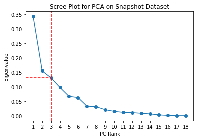

## Figure 2
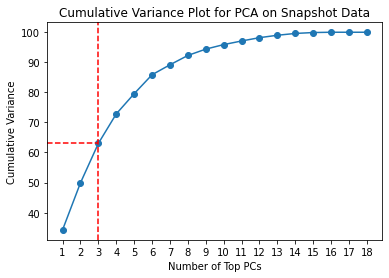

## Figure 3
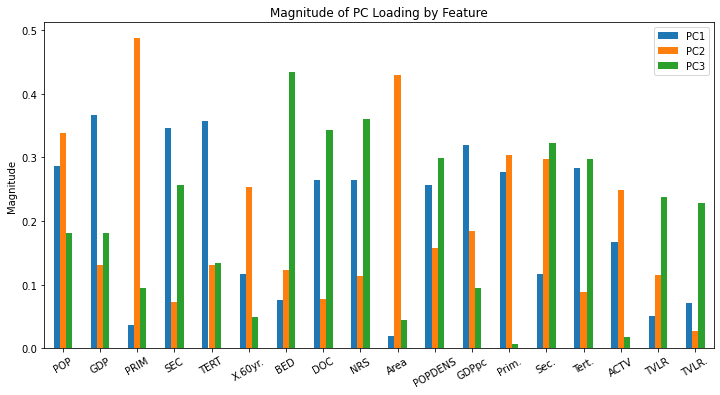

## Figure 4
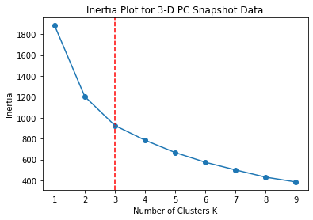

## Figure 5
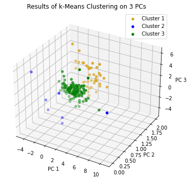

## Figure 6
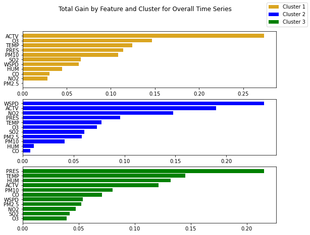

## Figure 7


## Figure 8
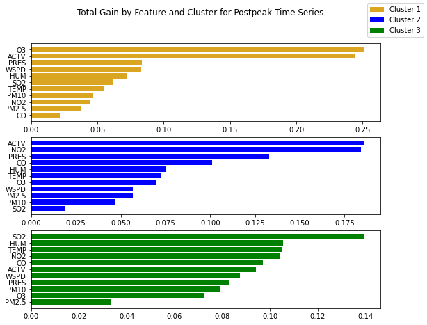

## Figure 9
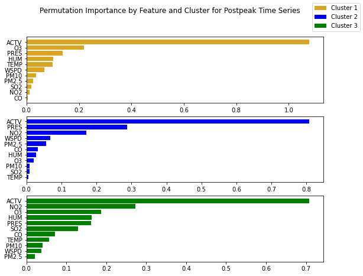

## Figure 10
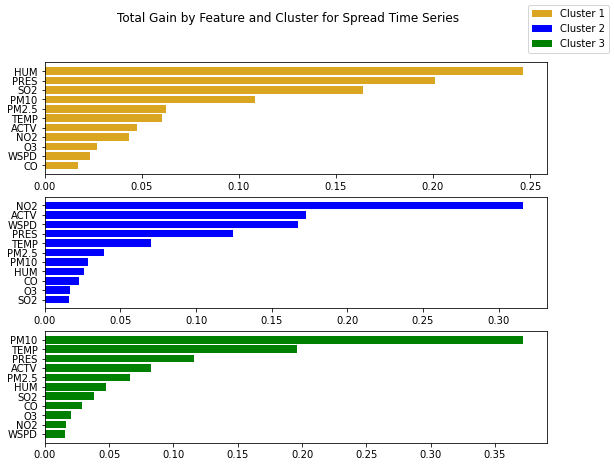

## Figure 11
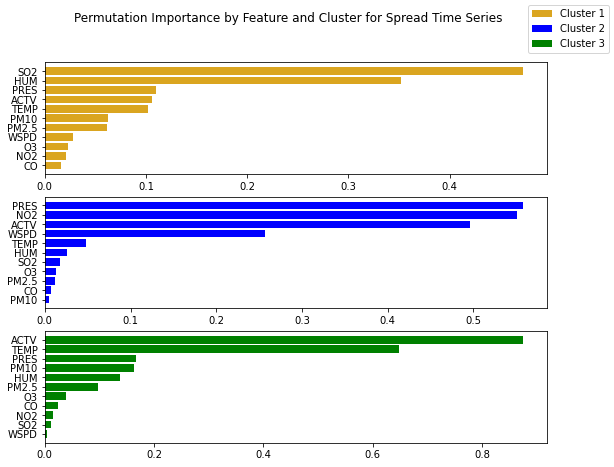

\begin{sidewaystable}
  \caption{XGBoost Model Hyperparameters and R-Squared}
\begin{tabular}{rrrrrrrrrr}
  \hline
  & Cluster 1 & & &  Cluster 2 & & & Cluster 3 & & \\ 

 & Overall & Post\_Peak & Spreading & Overall & Post\_Peak & Spreading & Overall & Post\_Peak & Spreading \\ 
  \hline
param\_learning\_rate & 0.05 & 0.01 & 0.01 & 0.01 & 0.01 & 0.01 & 0.01 & 0.01 & 0.01 \\ 
  param\_n\_estimators & 300.00 & 200.00 & 200.00 & 250.00 & 150.00 & 150.00 & 300.00 & 200.00 & 200.00 \\ 
  mean\_test\_score & 0.76 & 0.73 & 0.74 & 0.71 & 0.59 & 0.60 & 0.81 & 0.67 & 0.65 \\ 
   \hline
\end{tabular}
\end{sidewaystable}

## Figure 12
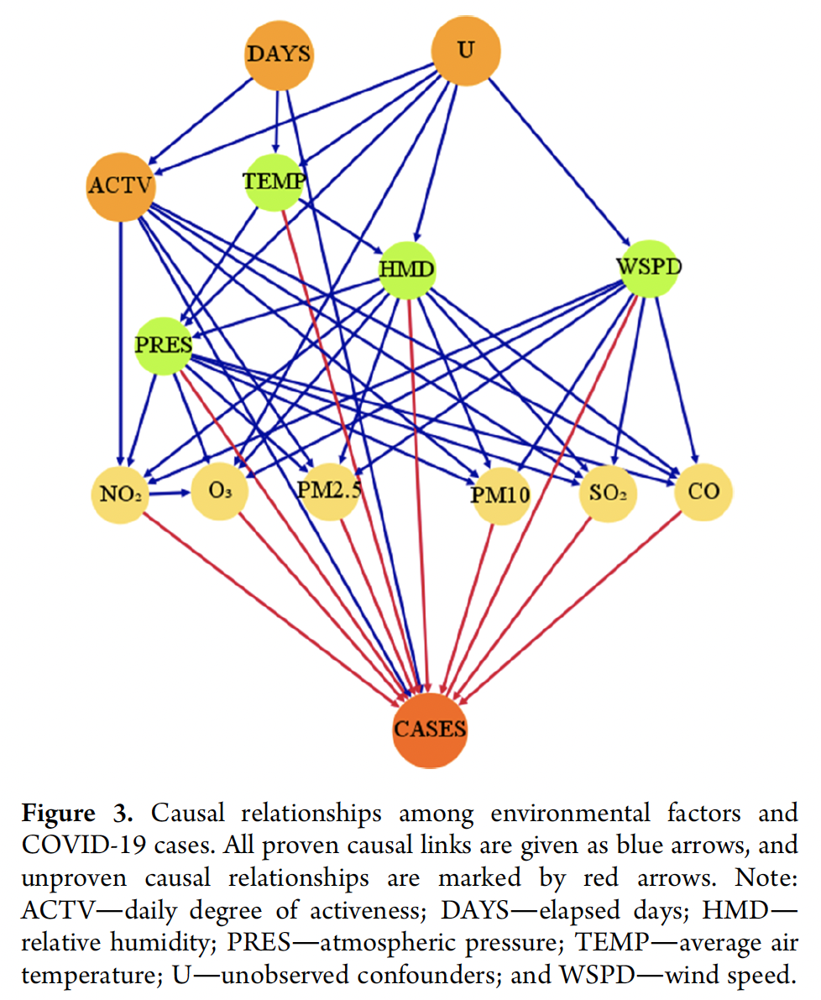
\begin{table}
\begin{center}
\caption{Estimated Treatment Effects for Cluster 1}
\begin{tabular}{ |c|c|c|c|c| } 
\hline 
Model Type & Pressure Estimate & Temperature Estimate & Humidity Estimate & Windspeed Estimate \\ 
\hline 
OLS & 0.070 & -0.057 & -0.154  & -0.208 \\ 
\hline
ORF & 0.057 & -0.131 & -0.129 &  -0.214 \\
\hline
\end{tabular}
\end{center}
\end{table}

\begin{table}
\begin{center}
\caption{Estimated Treatment Effects for Cluster 2}
\begin{tabular}{ |c|c|c|c|c| } 
\hline 
Model Type & Pressure Estimate & Temperature Estimate & Humidity Estimate & Windspeed Estimate \\ 
\hline 
OLS & 0.030 & 0.011 & 0.001  & -0.048 \\ 
\hline
ORF & 0.049 & 0.0002 & 0.003 & -0.039 \\
\hline
\end{tabular}
\end{center}
\end{table}

\newpage 
\begin{thebibliography}{9}
  \bibitem{1} Kang, Q. (2021, April 19). Kangqiao-Ctrl/EnvCausal: A causal inference framework for environmental data analysis. GitHub. Retrieved from https://github.com/kangqiao-ctrl/EnvCausal.
  \bibitem{2} Kang, Q., Song, X., \& Xin, X. (2021). (publication). (B. Chen, Y. Chen, X. Ye, \& B. Zhang, Eds.)Supporting Information: Machine Learning–Aided Causal Inference Framework for Environmental Data Analysis: A COVID-19 Case Study(pp. S1–S25). St. John’s, NL: Memorial University of Newfoundland. 
  \bibitem{3} Kang, Q., Song, X., Xin, X., Chen, Y., \& Ye, X. (2021). (publication). (B. Chen , Ed.)Machine Learning-Aided Causal Inference Framework for Environmental Data Analysis: A COVID-19 Case Study. American Chemical Society. Retrieved from https://pubs.acs.org/doi/10.1021/acs.est.1c02204?ref=pdf.
  \bibitem{4} Jolliffe Ian T. and Cadima Jorge. 2016 Principal component analysis: a review and 
recent developments. Phil. Trans. R. Soc. A. 374 20150202 20150202.
\end{thebibliography}

\newpage 

# Code Appendix 

``` {r dc, echo = FALSE, eval = FALSE}
# Libraries for data processing and math 
import pandas as pd
import numpy as np

# Library for plotting 
import matplotlib.pyplot as plt
from mpl_toolkits import mplot3d

# Library for file path manipulation 
import os

# Libraries for machine learning algorithms 
from sklearn.preprocessing import StandardScaler
from sklearn.decomposition import PCA
from sklearn.cluster import KMeans

# Set seed to control randomness
np.random.seed(156)
# This gets the file path of the data folder in EnvCausal-replication 
root = os.path.dirname(os.getcwd())
data_dir = os.path.join(root, 'data')

# Set the file path for the cleaned snapshot data set
snapshot_path = os.path.join(data_dir, 'cleaned_snapshot_data.csv')

# Read snapshots data set 
snapshots = pd.read_csv(snapshot_path, index_col=0).reset_index().iloc[:, 1:]

# Scale the data 
scaler = StandardScaler()
city_labels = snapshots.iloc[:, 0]
scaled_snapshots = scaler.fit_transform(snapshots.iloc[:, 1:])
# Perform Principal Components Analysis 
n_components = scaled_snapshots.shape[1] 
pca = PCA(n_components=n_components, svd_solver='full')
pca.fit(scaled_snapshots)
# Separately fit PCA with 3 components following paper 
pca_reduce = PCA(n_components=3, svd_solver='full') # project data onto 3 dimensions, as in paper 
pca_reduce.fit(scaled_snapshots)
snapshots_pca_3 = pca_reduce.transform(scaled_snapshots)
city_df = pd.DataFrame({'City':city_labels})
pca_df = pd.DataFrame(snapshots_pca_3)
projection_df = pd.concat([city_df, pca_df], axis=1).set_index('City')
explained_variances = pca.explained_variance_ratio_
var_by_pc_num = np.cumsum(np.round(explained_variances, decimals=3)*100)
# Scree Plot
plt.title('Scree Plot for PCA on Snapshot Dataset')
plt.xlabel('PC Rank')
plt.ylabel('Eigenvalue')
plt.xticks(np.arange(1, n_components+1))
plt.plot(np.arange(1, n_components+1), explained_variances)
plt.axvline(x=3, color='r', linestyle='dashed')
plt.axhline(y=explained_variances[2], xmin=0, xmax=0.15, color='r', linestyle='dashed')
plt.scatter(np.arange(1, n_components+1), explained_variances);
# Cumulative Variance by PCs
plt.title('Cumulative Variance Plot for PCA on Snapshot Data')
plt.xlabel('Number of Top PCs')
plt.ylabel('Cumulative Variance')
plt.yticks(np.arange(0, 101, 10))
plt.xticks(np.arange(1, n_components+1))
plt.plot(np.arange(1, n_components+1), var_by_pc_num)
plt.axvline(x=3, color='r', linestyle='dashed')
plt.axhline(y=var_by_pc_num[2], xmin=0, xmax=0.15, color='r', linestyle='dashed')
plt.scatter(np.arange(1, n_components+1), var_by_pc_num);
# Generate plot of Magnitude of features present in top 3 PCs (Figure S1) 
# Extract PC loadings 
pca_3comp_df = pd.DataFrame(pca_reduce.components_)
pca_3comp_df.columns = snapshots.columns[1:]
cleaned_pca_3_df = pca_3comp_df.T.reset_index()
cleaned_pca_3_df.columns = ['Variables', 'PC1', 'PC2', 'PC3']
cleaned_pca_3_df = cleaned_pca_3_df.apply(
    lambda x: np.abs(x) if x.name != 'Variables' else x)
cleaned_pca_3_df.plot(x="Variables", y=['PC1', 'PC2', 'PC3'], kind="bar",
                     figsize=(12,6), rot=30)
plt.title('Magnitude of PC Loading by Feature')
plt.ylabel('Magnitude')
plt.xlabel('');
# k-Means Inertia plot (Figure S2)
inertias = []
n_clusters_test = 9 # test up to 9 clusters in the snapshot data
clusters_to_try = np.arange(1, n_clusters_test+1)
for i in clusters_to_try:
    km = KMeans(n_clusters=i)
    km.fit_predict(projection_df)
    curr_inertia = km.inertia_
    inertias.append(curr_inertia)
plt.title('Inertia Plot for 3-D PC Snapshot Data')
plt.xlabel('Number of Clusters K')
plt.ylabel('Inertia')
plt.axvline(x=3, color='r', linestyle='dashed')
plt.scatter(clusters_to_try, inertias)
plt.plot(clusters_to_try, inertias);
# Final k-Means clustering 
num_clusters = 3 # generate 3 clusters of cities, consistent with the paper 
kmeans = KMeans(n_clusters=num_clusters)
kmeans.fit(projection_df)
predicted_clusters = kmeans.labels_
cluster_projection_df = projection_df.copy()
cluster_projection_df['Cluster'] = predicted_clusters
# Plot of clustered data in PC space (Figure S3)
cluster_1 = cluster_projection_df[cluster_projection_df['Cluster'] == 0]
cluster_2 = cluster_projection_df[cluster_projection_df['Cluster'] == 1]
cluster_3 = cluster_projection_df[cluster_projection_df['Cluster'] == 2]

# Keep PC indexing consistent with notation in paper 
x1 = cluster_1.iloc[:, 1]
y1 = cluster_1.iloc[:, 3]
z1 = cluster_1.iloc[:, 2]
x2 = cluster_2.iloc[:, 1]
y2 = cluster_2.iloc[:, 3]
z2 = cluster_2.iloc[:, 2]
x3 = cluster_3.iloc[:, 1]
y3 = cluster_3.iloc[:, 3]
z3 = cluster_3.iloc[:, 2]

fig = plt.figure(figsize = (6, 6))
ax = plt.axes(projection ="3d")
# Keep cluster labeling consistent with results in paper 
ax.scatter3D(x3, y3, z3, color = "goldenrod", label='Cluster 1')
ax.scatter3D(x1, y1, z1, color = "blue", label='Cluster 2')
ax.scatter3D(x2, y2, z2, color = "green", label='Cluster 3')

#plt.xticks(np.arange(-2,11,2))
#plt.yticks(np.arange(-5, 11, 2.5)) # weird decision, since this compresses clusters together
#ax.set_zticks(np.arange(-4, 7, 2))
ax.set_xlabel('PC 1')
ax.set_ylabel('PC 2')
ax.set_zlabel('PC 3')
plt.legend()
ax.view_init(azim=-60, elev=30)
plt.title("Results of k-Means Clustering on 3 PCs");
# Libraries for data processing and math 
import pandas as pd
import numpy as np

# Library for file path manipulation 
import os

# Libraries for machine learning algorithms 
import xgboost as xgb
from sklearn.model_selection import GridSearchCV
from sklearn.metrics import r2_score

# Set seed to control randomness
np.random.seed(156)
# This gets the file path of the data folder in EnvCausal-replication 
root = os.path.dirname(os.getcwd())
data_dir = os.path.join(root, 'data')

# Set the file path for the time series datasets (9 total)
c1_overall_path = os.path.join(data_dir, 'time_cluster_1.csv')
c1_postpeak_path = os.path.join(data_dir, 'time_cluster_1_postpeak.csv')
c1_spread_path = os.path.join(data_dir, 'time_cluster_1_spread.csv')
c2_overall_path = os.path.join(data_dir, 'time_cluster_2.csv')
c2_postpeak_path = os.path.join(data_dir, 'time_cluster_2_postpeak.csv')
c2_spread_path = os.path.join(data_dir, 'time_cluster_2_spread.csv')
c3_overall_path = os.path.join(data_dir, 'time_cluster_3.csv')
c3_postpeak_path = os.path.join(data_dir, 'time_cluster_3_postpeak.csv')
c3_spread_path = os.path.join(data_dir, 'time_cluster_3_spread.csv')

# Read time series datasets 
c1_overall = pd.read_csv(c1_overall_path).drop(columns=['Unnamed: 0', 'X.1'])
c1_postpeak = pd.read_csv(c1_postpeak_path).drop(columns=['Unnamed: 0', 'X.1'])
c1_spread = pd.read_csv(c1_spread_path).drop(columns=['Unnamed: 0', 'X.1'])
c2_overall = pd.read_csv(c2_overall_path).drop(columns=['Unnamed: 0', 'X.1'])
c2_postpeak = pd.read_csv(c2_postpeak_path).drop(columns=['Unnamed: 0', 'X.1'])
c2_spread = pd.read_csv(c2_spread_path).drop(columns=['Unnamed: 0', 'X.1'])
c3_overall = pd.read_csv(c3_overall_path).drop(columns=['Unnamed: 0', 'X.1'])
c3_postpeak = pd.read_csv(c3_postpeak_path).drop(columns=['Unnamed: 0', 'X.1'])
c3_spread = pd.read_csv(c3_spread_path).drop(columns=['Unnamed: 0', 'X.1'])

# Set path for writing hyperparameter results 
hyperparam_dir = os.path.join(data_dir, 'hyperparam_opt')
# Define hyperparameters to grid search over (set by authors in Table S4 of extended paper)
parameters = {
              'njobs':[-1],
              'learning_rate':[0.1], # this is the best value from the paper 
              #'learning_rate': [0.01,0.05,0.1,0.2,0.3], 
              'max_depth': np.arange(2, 6), # don't have time to run all combos from 2-10
              'min_child_weight': np.arange(8, 11), # don't have time to run all combos from 2-10
              'n_estimators':[50], # this is the best value from the paper 
              #'n_estimators': [25,50,75,100,150,200,250,300],
              'eval_metric': [r2_score],
              'seed': [156],
              'objective':['reg:squarederror']
            }
key_metrics = ['param_learning_rate', 
               'param_max_depth', 
               'param_min_child_weight', 
              'param_n_estimators', 'mean_test_score']
feature_set = ['PM2.5', 'PM10', 'SO2', 'CO', 'NO2', 'O3', 'HUM', 'PRES', 'WSPD', 'TEMP', 'ACTV', ]
# Define X and Y variables 
c1_overall_data = c1_overall[feature_set]
c1_overall_target = c1_overall['Case']
# Initialize XGBoost model and GridSearchCV process 
xgb_c1_overall = xgb.XGBRegressor()
c1_overall_gridsearch = GridSearchCV(estimator=xgb_c1_overall, param_grid=parameters,
                                     n_jobs=-1, cv=5, verbose=2)
# Train the models
c1_overall_gridsearch.fit(c1_overall_data, c1_overall_target);
c1_overall_result = pd.DataFrame(c1_overall_gridsearch.cv_results_).sort_values(
    'mean_test_score', ascending=False).iloc[0][key_metrics].to_frame()
c1_overall_dir = os.path.join(hyperparam_dir, 'c1_overall_best_XGB.csv')
c1_overall_result.T.to_csv(c1_overall_dir, index=False)
# Define X and Y variables 
c1_postpeak_data = c1_postpeak[feature_set]
c1_postpeak_target = c1_postpeak['Case']
# Initialize XGBoost model and GridSearchCV process 
xgb_c1_postpeak = xgb.XGBRegressor()
c1_postpeak_gridsearch = GridSearchCV(estimator=xgb_c1_postpeak, param_grid=parameters,
                                     n_jobs=-1, cv=5, verbose=2, scoring='r2')
# Train the models
c1_postpeak_gridsearch.fit(c1_postpeak_data, c1_postpeak_target);
c1_postpeak_result = pd.DataFrame(c1_postpeak_gridsearch.cv_results_).sort_values(
    'mean_test_score', ascending=False).iloc[0][key_metrics].to_frame()
c1_postpeak_dir = os.path.join(hyperparam_dir, 'c1_postpeak_best_XGB.csv')
c1_postpeak_result.T.to_csv(c1_postpeak_dir, index=False)
# Define X and Y variables 
c1_spread_data = c1_spread[feature_set]
c1_spread_target = c1_spread['Case']
# Initialize XGBoost model and GridSearchCV process 
xgb_c1_spread = xgb.XGBRegressor()
c1_spread_gridsearch = GridSearchCV(estimator=xgb_c1_spread, param_grid=parameters,
                                     n_jobs=-1, cv=5, verbose=2, scoring='r2')
# Train the models
c1_spread_gridsearch.fit(c1_spread_data, c1_spread_target);
c1_spread_result = pd.DataFrame(c1_spread_gridsearch.cv_results_).sort_values(
    'mean_test_score', ascending=False).iloc[0][key_metrics].to_frame()
c1_spread_dir = os.path.join(hyperparam_dir, 'c1_spread_best_XGB.csv')
c1_spread_result.T.to_csv(c1_spread_dir, index=False)
# Define X and Y variables 
c2_overall_data = c2_overall[feature_set]
c2_overall_target = c2_overall['Case']
# Initialize XGBoost model and GridSearchCV process 
xgb_c2_overall = xgb.XGBRegressor()
c2_overall_gridsearch = GridSearchCV(estimator=xgb_c2_overall, param_grid=parameters,
                                     n_jobs=-1, cv=5, verbose=2, scoring='r2')
# Train the models
c2_overall_gridsearch.fit(c2_overall_data, c2_overall_target);
c2_overall_result = pd.DataFrame(c2_overall_gridsearch.cv_results_).sort_values(
    'mean_test_score', ascending=False).iloc[0][key_metrics].to_frame()
c2_overall_dir = os.path.join(hyperparam_dir, 'c2_overall_best_XGB.csv')
c2_overall_result.T.to_csv(c2_overall_dir, index=False)

# Define X and Y variables 
c2_postpeak_data = c2_postpeak[feature_set]
c2_postpeak_target = c2_postpeak['Case']
# Initialize XGBoost model and GridSearchCV process 
xgb_c2_postpeak = xgb.XGBRegressor()
c2_postpeak_gridsearch = GridSearchCV(estimator=xgb_c2_postpeak, param_grid=parameters,
                                     n_jobs=-1, cv=5, verbose=2, scoring='r2')
# Train the models
c2_postpeak_gridsearch.fit(c2_postpeak_data, c2_postpeak_target);
c2_postpeak_result = pd.DataFrame(c2_postpeak_gridsearch.cv_results_).sort_values(
    'mean_test_score', ascending=False).iloc[0][key_metrics].to_frame()
c2_postpeak_dir = os.path.join(hyperparam_dir, 'c2_postpeak_best_XGB.csv')
c2_postpeak_result.T.to_csv(c2_postpeak_dir, index=False)
# Define X and Y variables 
c2_spread_data = c2_spread[feature_set]
c2_spread_target = c2_spread['Case']
# Initialize XGBoost model and GridSearchCV process 
xgb_c2_spread = xgb.XGBRegressor()
c2_spread_gridsearch = GridSearchCV(estimator=xgb_c2_spread, param_grid=parameters,
                                     n_jobs=-1, cv=5, verbose=2, scoring='r2')
# Train the models
c2_spread_gridsearch.fit(c2_spread_data, c2_spread_target);
c2_spread_result = pd.DataFrame(c2_spread_gridsearch.cv_results_).sort_values(
    'mean_test_score', ascending=False).iloc[0][key_metrics].to_frame()
c2_spread_dir = os.path.join(hyperparam_dir, 'c2_spread_best_XGB.csv')
c2_spread_result.T.to_csv(c2_spread_dir, index=False)
# Define X and Y variables 
c3_overall_data = c3_overall[feature_set]
c3_overall_target = c3_overall['Case']
# Initialize XGBoost model and GridSearchCV process 
xgb_c3_overall = xgb.XGBRegressor()
c3_overall_gridsearch = GridSearchCV(estimator=xgb_c3_overall, param_grid=parameters,
                                     n_jobs=-1, cv=5, verbose=2, scoring='r2')
# Train the models
c3_overall_gridsearch.fit(c3_overall_data, c3_overall_target);
c3_overall_result = pd.DataFrame(c3_overall_gridsearch.cv_results_).sort_values(
    'mean_test_score', ascending=False).iloc[0][key_metrics].to_frame()
c3_overall_dir = os.path.join(hyperparam_dir, 'c3_overall_best_XGB.csv')
c3_overall_result.T.to_csv(c3_overall_dir, index=False)
# Define X and Y variables 
c3_postpeak_data = c3_postpeak[feature_set]
c3_postpeak_target = c3_postpeak['Case']
# Initialize XGBoost model and GridSearchCV process 
xgb_c3_postpeak = xgb.XGBRegressor()
c3_postpeak_gridsearch = GridSearchCV(estimator=xgb_c3_postpeak, param_grid=parameters,
                                     n_jobs=-1, cv=5, verbose=2, scoring='r2')
# Train the models
c3_postpeak_gridsearch.fit(c3_postpeak_data, c3_postpeak_target);
c3_postpeak_result = pd.DataFrame(c3_postpeak_gridsearch.cv_results_).sort_values(
    'mean_test_score', ascending=False).iloc[0][key_metrics].to_frame()
c3_postpeak_dir = os.path.join(hyperparam_dir, 'c3_postpeak_best_XGB.csv')
c3_postpeak_result.T.to_csv(c3_postpeak_dir, index=False)


# Define X and Y variables 
c3_spread_data = c3_spread[feature_set]
c3_spread_target = c3_spread['Case']
# Initialize XGBoost model and GridSearchCV process 
xgb_c3_spread = xgb.XGBRegressor()
c3_spread_gridsearch = GridSearchCV(estimator=xgb_c3_spread, param_grid=parameters,
                                     n_jobs=-1, cv=5, verbose=2, scoring='r2')
# Train the models
c3_spread_gridsearch.fit(c3_spread_data, c3_spread_target);
c3_spread_result = pd.DataFrame(c3_spread_gridsearch.cv_results_).sort_values(
    'mean_test_score', ascending=False).iloc[0][key_metrics].to_frame()
c3_spread_dir = os.path.join(hyperparam_dir, 'c3_spread_best_XGB.csv')
c3_spread_result.T.to_csv(c3_spread_dir, index=False)
# Libraries for data processing and math 
import pandas as pd
import numpy as np

# Library for data visualization
import matplotlib.pyplot as plt

# Library for file path manipulation 
import os

# Libraries for machine learning algorithms 
import xgboost as xgb
from sklearn.inspection import permutation_importance
# import shap not using this due to time constraint 

# Set seed to control randomness
np.random.seed(156)

# Set feautures to find importances of 
feature_set = ['PM2.5', 'PM10', 'SO2', 'CO', 'NO2', 'O3', 'HUM', 'PRES', 'WSPD', 'TEMP', 'ACTV']
# Load the data and train the XGBoost models
root = os.path.dirname(os.getcwd())
data_dir = os.path.join(root, 'data')
### Cluster 1 Overall ###
c1_overall_path = os.path.join(data_dir, 'time_cluster_1.csv')
c1_overall = pd.read_csv(c1_overall_path)
c1_overall_data = c1_overall[feature_set]
c1_overall_target = c1_overall['Case']
### Cluster 2 Overall ###
c2_overall_path = os.path.join(data_dir, 'time_cluster_2.csv')
c2_overall = pd.read_csv(c2_overall_path)
c2_overall_data = c2_overall[feature_set]
c2_overall_target = c2_overall['Case']
### Cluster 3 Overall ###
c3_overall_path = os.path.join(data_dir, 'time_cluster_3.csv')
c3_overall = pd.read_csv(c3_overall_path)
c3_overall_data = c3_overall[feature_set]
c3_overall_target = c3_overall['Case']
### Cluster 1 Overall Hyperparams ###
max_depth1 = 2
min_child_weight1 = 8
n_estimators1 = 50
learning_rate1 = 0.1
### Cluster 2 Overall Hyperparams ###
max_depth2 = 3
min_child_weight2 = 8
n_estimators2 = 50
learning_rate2 = 0.1
### Cluster 3 Overall Hyperparams ###
max_depth3 = 5
min_child_weight3 = 3
n_estimators3 = 50
learning_rate3 = 0.1
### Train model for Cluster 1 ###
xgb_c1_overall = xgb.XGBRegressor(max_depth=max_depth1,
                                  min_child_weight=min_child_weight1,
                                  n_estimators=n_estimators1,
                                  learning_rate=learning_rate1)
xgb_c1_overall.fit(c1_overall_data, c1_overall_target);
### Train model for Cluster 2 ###
xgb_c2_overall = xgb.XGBRegressor(max_depth=max_depth2,
                                  min_child_weight=min_child_weight2,
                                  n_estimators=n_estimators2,
                                  learning_rate=learning_rate2)
xgb_c2_overall.fit(c2_overall_data, c2_overall_target);
### Train model for Cluster 3 ###
xgb_c3_overall = xgb.XGBRegressor(max_depth=max_depth3,
                                  min_child_weight=min_child_weight3,
                                  n_estimators=n_estimators3,
                                  learning_rate=learning_rate3)
xgb_c3_overall.fit(c3_overall_data, c3_overall_target);

# Plot Total Gain by Feature 
fig, (ax1, ax2, ax3) = plt.subplots(3, figsize=(9,7))
fig.suptitle('Total Gain by Feature and Cluster for Overall Time Series')
# Create plot for Cluster 1 
sorted_idx_gain_c1_overall = xgb_c1_overall.feature_importances_.argsort()
ax1.barh(c1_overall_data.columns[sorted_idx_gain_c1_overall],
         xgb_c1_overall.feature_importances_[sorted_idx_gain_c1_overall],
         color='goldenrod', label='Cluster 1')
# Create plot for Cluster 2
sorted_idx_gain_c2_overall = xgb_c2_overall.feature_importances_.argsort()
ax2.barh(c2_overall_data.columns[sorted_idx_gain_c2_overall],
         xgb_c2_overall.feature_importances_[sorted_idx_gain_c2_overall],
         color='Blue', label='Cluster 2')
# Create plot for Cluster 3
sorted_idx_gain_c3_overall = xgb_c3_overall.feature_importances_.argsort()
ax3.barh(c3_overall_data.columns[sorted_idx_gain_c3_overall],
         xgb_c3_overall.feature_importances_[sorted_idx_gain_c3_overall],
         color='Green', label='Cluster 3')
fig.legend();

# Plot Permutation Importance by Feature 
fig, (ax1, ax2, ax3) = plt.subplots(3, figsize=(9,7))
fig.suptitle('Permutation Importance by Feature and Cluster for Overall Time Series')
# Create plot for Cluster 1 
perm_importance_c1_overall = permutation_importance(xgb_c1_overall, c1_overall_data, c1_overall_target)
sorted_idx_perm_c1_overall = perm_importance_c1_overall.importances_mean.argsort()
ax1.barh(c1_overall_data.columns[sorted_idx_perm_c1_overall],
         perm_importance_c1_overall.importances_mean[sorted_idx_perm_c1_overall],
         color='goldenrod', label='Cluster 1')
# Create plot for Cluster 2 
perm_importance_c2_overall = permutation_importance(xgb_c2_overall, c2_overall_data, c2_overall_target)
sorted_idx_perm_c2_overall = perm_importance_c2_overall.importances_mean.argsort()
ax2.barh(c2_overall_data.columns[sorted_idx_perm_c2_overall],
         perm_importance_c2_overall.importances_mean[sorted_idx_perm_c2_overall],
         color='blue', label='Cluster 2')
# Create plot for Cluster 3 
perm_importance_c3_overall = permutation_importance(xgb_c3_overall, c3_overall_data, c3_overall_target)
sorted_idx_perm_c3_overall = perm_importance_c3_overall.importances_mean.argsort()
ax3.barh(c3_overall_data.columns[sorted_idx_perm_c3_overall],
         perm_importance_c3_overall.importances_mean[sorted_idx_perm_c3_overall],
         color='green', label='Cluster 3')
fig.legend();
# Load the data and train the XGBoost models
root = os.path.dirname(os.getcwd())
data_dir = os.path.join(root, 'data')
### Cluster 1 Overall ###
c1_postpeak_path = os.path.join(data_dir, 'time_cluster_1_postpeak.csv')
c1_postpeak = pd.read_csv(c1_postpeak_path)
c1_postpeak_data = c1_postpeak[feature_set]
c1_postpeak_target = c1_postpeak['Case']
### Cluster 2 Overall ###
c2_postpeak_path = os.path.join(data_dir, 'time_cluster_2_postpeak.csv')
c2_postpeak = pd.read_csv(c2_postpeak_path)
c2_postpeak_data = c2_postpeak[feature_set]
c2_postpeak_target = c2_postpeak['Case']
### Cluster 3 Overall ###
c3_postpeak_path = os.path.join(data_dir, 'time_cluster_3_postpeak.csv')
c3_postpeak = pd.read_csv(c3_postpeak_path)
c3_postpeak_data = c3_postpeak[feature_set]
c3_postpeak_target = c3_postpeak['Case']
### Cluster 1 Postpeak Hyperparams ###
max_depth1 = 4
min_child_weight1 = 8
n_estimators1 = 50
learning_rate1 = 0.1
### Cluster 2 Postpeak Hyperparams ###
max_depth2 = 3
min_child_weight2 = 8
n_estimators2 = 50
learning_rate2 = 0.1
### Cluster 3 Postpeak Hyperparams ###
max_depth3 = 5
min_child_weight3 = 6
n_estimators3 = 50
learning_rate3 = 0.1
### Train model for Cluster 1 ###
xgb_c1_postpeak = xgb.XGBRegressor(max_depth=max_depth1,
                                  min_child_weight=min_child_weight1,
                                  n_estimators=n_estimators1,
                                  learning_rate=learning_rate1)
xgb_c1_postpeak.fit(c1_postpeak_data, c1_postpeak_target);
### Train model for Cluster 2 ###
xgb_c2_postpeak = xgb.XGBRegressor(max_depth=max_depth2,
                                  min_child_weight=min_child_weight2,
                                  n_estimators=n_estimators2,
                                  learning_rate=learning_rate2)
xgb_c2_postpeak.fit(c2_postpeak_data, c2_postpeak_target);
### Train model for Cluster 3 ###
xgb_c3_postpeak = xgb.XGBRegressor(max_depth=max_depth3,
                                  min_child_weight=min_child_weight3,
                                  n_estimators=n_estimators3,
                                  learning_rate=learning_rate3)
xgb_c3_postpeak.fit(c3_postpeak_data, c3_postpeak_target);

# Plot Total Gain by Feature 
fig, (ax1, ax2, ax3) = plt.subplots(3, figsize=(9,7))
fig.suptitle('Total Gain by Feature and Cluster for Postpeak Time Series')
# Create plot for Cluster 1 
sorted_idx_gain_c1_postpeak = xgb_c1_postpeak.feature_importances_.argsort()
ax1.barh(c1_postpeak_data.columns[sorted_idx_gain_c1_postpeak],
         xgb_c1_postpeak.feature_importances_[sorted_idx_gain_c1_postpeak],
         color='goldenrod', label='Cluster 1')
# Create plot for Cluster 2
sorted_idx_gain_c2_postpeak = xgb_c2_postpeak.feature_importances_.argsort()
ax2.barh(c2_postpeak_data.columns[sorted_idx_gain_c2_postpeak],
         xgb_c2_postpeak.feature_importances_[sorted_idx_gain_c2_postpeak],
         color='blue', label='Cluster 2')
# Create plot for Cluster 3 
sorted_idx_gain_c3_postpeak = xgb_c3_postpeak.feature_importances_.argsort()
ax3.barh(c3_postpeak_data.columns[sorted_idx_gain_c3_postpeak],
         xgb_c3_postpeak.feature_importances_[sorted_idx_gain_c3_postpeak],
         color='green', label='Cluster 3')
fig.legend();
# Plot Permutation Importance by Feature 
fig, (ax1, ax2, ax3) = plt.subplots(3, figsize=(9,7))
fig.suptitle('Permutation Importance by Feature and Cluster for Postpeak Time Series')
# Create plot for Cluster 1 
perm_importance_c1_postpeak = permutation_importance(xgb_c1_postpeak, c1_postpeak_data, c1_postpeak_target)
sorted_idx_perm_c1_postpeak = perm_importance_c1_postpeak.importances_mean.argsort()
ax1.barh(c1_postpeak_data.columns[sorted_idx_perm_c1_postpeak],
         perm_importance_c1_postpeak.importances_mean[sorted_idx_perm_c1_postpeak],
         color='goldenrod', label='Cluster 1')
# Create plot for Cluster 2 
perm_importance_c2_postpeak = permutation_importance(xgb_c2_postpeak, c2_postpeak_data, c2_postpeak_target)
sorted_idx_perm_c2_postpeak = perm_importance_c2_postpeak.importances_mean.argsort()
ax2.barh(c2_postpeak_data.columns[sorted_idx_perm_c2_postpeak],
         perm_importance_c2_postpeak.importances_mean[sorted_idx_perm_c2_postpeak],
         color='blue', label='Cluster 2')
# Create plot for Cluster 3 
perm_importance_c3_postpeak = permutation_importance(xgb_c3_postpeak, c3_postpeak_data, c3_postpeak_target)
sorted_idx_perm_c3_postpeak = perm_importance_c3_postpeak.importances_mean.argsort()
ax3.barh(c3_postpeak_data.columns[sorted_idx_perm_c3_postpeak],
         perm_importance_c3_postpeak.importances_mean[sorted_idx_perm_c3_postpeak],
         color='green', label='Cluster 3')
fig.legend();
# Load the data and train the XGBoost models
root = os.path.dirname(os.getcwd())
data_dir = os.path.join(root, 'data')
### Cluster 1 Overall ###
c1_spread_path = os.path.join(data_dir, 'time_cluster_1_spread.csv')
c1_spread = pd.read_csv(c1_spread_path)
c1_spread_data = c1_spread[feature_set]
c1_spread_target = c1_spread['Case']
### Cluster 2 Overall ###
c2_spread_path = os.path.join(data_dir, 'time_cluster_2_spread.csv')
c2_spread = pd.read_csv(c2_spread_path)
c2_spread_data = c2_spread[feature_set]
c2_spread_target = c2_spread['Case']
### Cluster 3 Overall ###
c3_spread_path = os.path.join(data_dir, 'time_cluster_3_spread.csv')
c3_spread = pd.read_csv(c3_spread_path)
c3_spread_data = c3_spread[feature_set]
c3_spread_target = c3_spread['Case']
### Cluster 1 Spread Hyperparams ###
max_depth1 = 4
min_child_weight1 = 9
n_estimators1 = 50
learning_rate1 = 0.1
### Cluster 2 Postpeak Hyperparams ###
max_depth2 = 4
min_child_weight2 = 9
n_estimators2 = 50
learning_rate2 = 0.1
### Cluster 3 Postpeak Hyperparams ###
max_depth3 = 4
min_child_weight3 = 8
n_estimators3 = 50
learning_rate3 = 0.1
### Train model for Cluster 1 ###
xgb_c1_spread = xgb.XGBRegressor(max_depth=max_depth1,
                                  min_child_weight=min_child_weight1,
                                  n_estimators=n_estimators1,
                                  learning_rate=learning_rate1)
xgb_c1_spread.fit(c1_spread_data, c1_spread_target);
### Train model for Cluster 2 ###
xgb_c2_spread = xgb.XGBRegressor(max_depth=max_depth2,
                                  min_child_weight=min_child_weight2,
                                  n_estimators=n_estimators2,
                                  learning_rate=learning_rate2)
xgb_c2_spread.fit(c2_spread_data, c2_spread_target);
### Train model for Cluster 3 ###
xgb_c3_spread = xgb.XGBRegressor(max_depth=max_depth3,
                                  min_child_weight=min_child_weight3,
                                  n_estimators=n_estimators3,
                                  learning_rate=learning_rate3)
xgb_c3_spread.fit(c3_spread_data, c3_spread_target);
 Plot Total Gain by Feature 
fig, (ax1, ax2, ax3) = plt.subplots(3, figsize=(9,7))
fig.suptitle('Total Gain by Feature and Cluster for Spread Time Series')
# Create plot for Cluster 1 
sorted_idx_gain_c1_spread = xgb_c1_spread.feature_importances_.argsort()
ax1.barh(c1_spread_data.columns[sorted_idx_gain_c1_spread],
         xgb_c1_spread.feature_importances_[sorted_idx_gain_c1_spread],
         color='goldenrod', label='Cluster 1')
# Create plot for Cluster 2
sorted_idx_gain_c2_spread = xgb_c2_spread.feature_importances_.argsort()
ax2.barh(c2_spread_data.columns[sorted_idx_gain_c2_spread],
         xgb_c2_spread.feature_importances_[sorted_idx_gain_c2_spread],
         color='blue', label='Cluster 2')
# Create plot for Cluster 3 
sorted_idx_gain_c3_spread = xgb_c3_spread.feature_importances_.argsort()
ax3.barh(c3_spread_data.columns[sorted_idx_gain_c3_spread],
         xgb_c3_spread.feature_importances_[sorted_idx_gain_c3_spread],
         color='green', label='Cluster 3')
fig.legend();
 Plot Total Gain by Feature 
fig, (ax1, ax2, ax3) = plt.subplots(3, figsize=(9,7))
fig.suptitle('Total Gain by Feature and Cluster for Spread Time Series')
# Create plot for Cluster 1 
sorted_idx_gain_c1_spread = xgb_c1_spread.feature_importances_.argsort()
ax1.barh(c1_spread_data.columns[sorted_idx_gain_c1_spread],
         xgb_c1_spread.feature_importances_[sorted_idx_gain_c1_spread],
         color='goldenrod', label='Cluster 1')
# Create plot for Cluster 2
sorted_idx_gain_c2_spread = xgb_c2_spread.feature_importances_.argsort()
ax2.barh(c2_spread_data.columns[sorted_idx_gain_c2_spread],
         xgb_c2_spread.feature_importances_[sorted_idx_gain_c2_spread],
         color='blue', label='Cluster 2')
# Create plot for Cluster 3 
sorted_idx_gain_c3_spread = xgb_c3_spread.feature_importances_.argsort()
ax3.barh(c3_spread_data.columns[sorted_idx_gain_c3_spread],
         xgb_c3_spread.feature_importances_[sorted_idx_gain_c3_spread],
         color='green', label='Cluster 3')
fig.legend();
# Libraries for data processing and math 
import pandas as pd
import numpy as np

# Library for causal estimation 
import dowhy
from dowhy import CausalModel
import econml
from sklearn.preprocessing import MinMaxScaler
from causal_estimate import ate_estimate 

# Library for file path manipulation 
import os

# Set seed to control randomness
np.random.seed(156)
# Load the data and train the XGBoost models
root = os.path.dirname(os.getcwd())
data_dir = os.path.join(root, 'data')
### Cluster 1 Overall ###
c1_overall_path = os.path.join(data_dir, 'time_cluster_1.csv')
c1_overall = pd.read_csv(c1_overall_path)
all_vars = ['days', 'ACTV', 'TEMP', 'HUM', 'WSPD', 'PRES', 'NO2', 'O3', 'PM2.5', 'PM10', 'SO2', 'CO', 'Case']
cluster1_df = c1_overall[all_vars]
# Normalize the data 
scaler = MinMaxScaler()
normalized = scaler.fit_transform(cluster1_df.values)
cluster1_df_norm = pd.DataFrame(normalized)
cluster1_df_norm.columns = cluster1_df.columns
cluster1_df_norm.head()
causal_graph = """
digraph {
days; 
ACTV; 
TEMP; 
U[label="Unobserved Confounders"];
HUM; 
WSPD; 
PRES; 
NO2; 
O3; 
PM2.5; 
PM10; 
SO2; 
CO; 
Case; 
days->ACTV; days->TEMP; days->Case; 
U->ACTV; U->TEMP; U->PRES; U->O3; U->HUM; U->WSPD; 
ACTV->NO2; ACTV->Case; ACTV->PM2.5; ACTV->PM10; ACTV->SO2; ACTV->CO; 
PRES->NO2; PRES->O3; PRES->PM2.5; PRES->PM10; PRES->SO2; PRES->C0; 
TEMP->PRES; TEMP->HUM; 
HUM->PRES; HUM->N02; HUM->O3; HUM->PM2.5; HUM->PM10; HUM->SO2; HUM->CO;
WSPD->N02; WSPD->O3; WSPD->PM2.5; WSPD->PM10; WSPD->SO2; WSPD->CO; 
NO2->O3; 
}
"""
from IPython.display import Image, display
model= CausalModel(
        data=cluster1_df,
        graph=causal_graph.replace("\n", " "),
        treatment='NO2',
        outcome='Case')
model.view_model()
# ATE estimation 
treatments = ['PRES', 'TEMP', 'HUM', 'WSPD', 'NO2', 'O3', 'PM2.5', 'PM10', 'SO2', 'CO']
curr_treatments = []
ate_linear1 = []
ate_forest1 = []
for treatment in treatments:
    try:
        first, second = ate_estimate(treatment=treatment, data=cluster1_df_norm, outcome='Case', causal_graph=causal_graph)
        curr_treatments.append(treatment)
        ate_linear1.append(first)
        ate_forest1.append(second)
    except Exception as e:
        continue 
for idx in range(len(curr_treatments)):
    print(f'Treatment: {treatments[idx]}')
    print('-----------------------------')
    print(f'ATE Linear: {ate_linear1[idx]}')
    print(f'ATE Forest: {ate_forest1[idx]}')
# Load the data and train the XGBoost models
root = os.path.dirname(os.getcwd())
data_dir = os.path.join(root, 'data')
### Cluster 2 Overall ###
c2_overall_path = os.path.join(data_dir, 'time_cluster_2.csv')
c2_overall = pd.read_csv(c2_overall_path)
all_vars = ['days', 'ACTV', 'TEMP', 'HUM', 'WSPD', 'PRES', 'NO2', 'O3', 'PM2.5', 'PM10', 'SO2', 'CO', 'Case']
cluster2_df = c2_overall[all_vars]
# Normalize the data 
scaler = MinMaxScaler()
normalized = scaler.fit_transform(cluster2_df.values)
cluster2_df_norm = pd.DataFrame(normalized)
cluster2_df_norm.columns = cluster2_df.columns
cluster2_df_norm.head()
# ATE estimation 
treatments = ['PRES', 'TEMP', 'HUM', 'WSPD', 'NO2', 'O3', 'PM2.5', 'PM10', 'SO2', 'CO']
curr_treatments = []
ate_linear2 = []
ate_forest2 = []
for treatment in treatments:
    try:
        first, second = ate_estimate(treatment=treatment, data=cluster2_df_norm, outcome='Case', causal_graph=causal_graph)
        curr_treatments.append(treatment)
        ate_linear2.append(first)
        ate_forest2.append(second)
    except Exception as e:
        continue 
for idx in range(len(curr_treatments)):
    print(f'Treatment: {curr_treatments[idx]}')
    print('-----------------------------')
    print(f'ATE Linear: {ate_linear2[idx]}')
    print(f'ATE Forest: {ate_forest2[idx]}')
# Load the data and train the XGBoost models
root = os.path.dirname(os.getcwd())
data_dir = os.path.join(root, 'data')
### Cluster 3 Overall ###
c3_overall_path = os.path.join(data_dir, 'time_cluster_3.csv')
c3_overall = pd.read_csv(c3_overall_path)
all_vars = ['days', 'ACTV', 'TEMP', 'HUM', 'WSPD', 'PRES', 'NO2', 'O3', 'PM2.5', 'PM10', 'SO2', 'CO', 'Case']
cluster3_df = c3_overall[all_vars]
# Normalize the data 
scaler = MinMaxScaler()
normalized = scaler.fit_transform(cluster3_df.values)
cluster3_df_norm = pd.DataFrame(normalized)
cluster3_df_norm.columns = cluster3_df.columns
cluster3_df_norm.head()
# ATE estimation 
treatments = ['PRES', 'TEMP', 'HUM', 'WSPD', 'NO2', 'O3', 'PM2.5', 'PM10', 'SO2', 'CO']
curr_treatments = []
ate_linear3 = []
ate_forest3 = []
for treatment in treatments:
    try:
        first, second = ate_estimate(treatment=treatment, data=cluster3_df_norm, outcome='Case', causal_graph=causal_graph)
        curr_treatments.append(treatment)
        ate_linear3.append(first)
        ate_forest3.append(second)
    except Exception as e:
        continue 
for idx in range(len(curr_treatments)):
    print(f'Treatment: {curr_treatments[idx]}')
    print('-----------------------------')
    print(f'ATE Linear: {ate_linear3[idx]}')
    print(f'ATE Forest: {ate_forest3[idx]}')
import dowhy
import econml

def ate_estimate(treatment, data, outcome, causal_graph):
    inspect_datasets = True
    inspect_models = True
    inspect_identified_estimands = True
    inspect_estimates = True
    inspect_refutations = True
    dowhy.causal_refuter.CausalRefuter.DEFAULT_NUM_SIMULATIONS = 100
    dataset = data
    causal_graph = causal_graph
    model = dowhy.CausalModel(data = dataset,
                        treatment = treatment,
                        outcome = outcome,
                        graph = causal_graph.replace("\n", " "))
    # print("####### Model #############################################################################################")
    # print("Common Causes:",model._common_causes)
    # print("Effect Modifiers:",model._effect_modifiers)
    # print("Instruments:",model._instruments)
    # print("Outcome:",model._outcome)
    # print("Treatment:",model._treatment)
    # print("#############################################################################################################")
    estimand = model.identify_effect(proceed_when_unidentifiable=True)
    # print("####### Identified Estimand #####################################################################################")
    # print(estimand)
    # print("###################################################################################################################")
    estimate_li = model.estimate_effect(estimand,method_name = "backdoor.linear_regression", method_params = None)
    estimate_forest = model.estimate_effect(estimand,method_name ="backdoor.econml.orf.DMLOrthoForest",
                                            method_params = {"init_params":{"n_jobs":-1},"fit_params":{}})
    #Linear Results
    #print("####### Linear Estimate ################################################################################")
    # print("*** Class Name ***")
    # print(estimate_li.params['estimator_class'])
    # # print("*** Treatment Name ***")
    # print(model._treatment)
    li_estimate = estimate_li.value
    #print(li_estimate)
    #print("########################################################################################################")
    #Forest Results
    #print("####### Forest Estimate#################################################################################")
    # print("*** Class Name ***")
    # print(estimate_forest.params['estimator_class'])
    # print("*** Treatment Name ***")
    # print(model._treatment)
    forest_estimate = estimate_forest.value
     #print(estimate_forest.value)
    #print("########################################################################################################")
    return li_estimate, forest_estimate
```

```{r ref.label=knitr::all_labels(), echo=TRUE, eval=FALSE}
```
